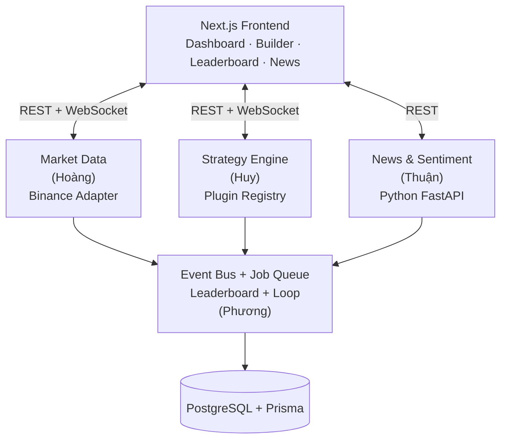

# System Architecture

## Architecture Style
**Modular Monolith**

> Rationale: 4 members / 4 weeks. A modular monolith gives clean module
> boundaries and independent development now, with the option to extract modules
> into services later if needed. Microservices would add infrastructure cost
> the team cannot afford within the timeline.

## High-Level Architecture Diagram



Modules depend on shared interfaces only — never on each other's implementations.

## Technology Stack
| Layer | Technology | Version | Notes |
|-------|-----------|---------|-------|
| Frontend | Next.js (TypeScript) | [TODO] | App router dashboard, real-time via WebSocket |
| Backend | NestJS (TypeScript) | [TODO] | Each NestJS module maps to a domain module |
| Database | PostgreSQL + Prisma | [TODO] | Type-safe ORM, JSONB for flexible strategy params |
| Module communication | EventEmitter2 | [TODO] | Event-driven; swap to Redis Pub/Sub later if needed |
| Extensibility | Strategy Registry + Adapter Pattern | n/a | Plugin arch for strategies, adapters for data sources |
| Sentiment service | Python FastAPI | [TODO] | Isolated process; frontend never touches it directly |
| Testing | [TODO — Jest / Vitest] | [TODO] | Unit tests for business logic |

## Source Code Structure

```
[TODO: confirm monorepo layout during W1]
apps/
├── backend/              # NestJS modular monolith
│   ├── market-data/      # Hoàng
│   ├── strategy/         # Huy
│   ├── news/             # Thuận
│   ├── events/           # Phương — event bus
│   ├── queue/            # Phương — job queue + workers
│   ├── leaderboard/      # Phương
│   ├── loop/             # Phương
│   └── dashboard/        # Phương — BFF composition layer
├── frontend/             # Next.js
└── sentiment-service/    # Python FastAPI — Thuận
shared/                   # All shared interfaces + Prisma schema
```

## Communication Patterns
- **Client → Server**: REST API (JSON) + WebSocket for real-time charts
- **Module → Module**: EventEmitter2 events (typed events, see `contracts/events`)
- **External**: Binance REST + WebSocket adapters; news providers via adapters; NestJS → Python sentiment via HTTP

## Data Flow
[TODO: describe the main data flow — see `flows/realtime-market-data.md` and `flows/strategy-backtest.md` once filled]

## Security Model
- **Authentication**: None (course project, no user accounts)
- **Authorization**: n/a
- **Data protection**: External API keys in `.env` (never committed); rate-limit handling in adapters

## Deployment Topology
[TODO: local dev + [TODO: deployment target]]
