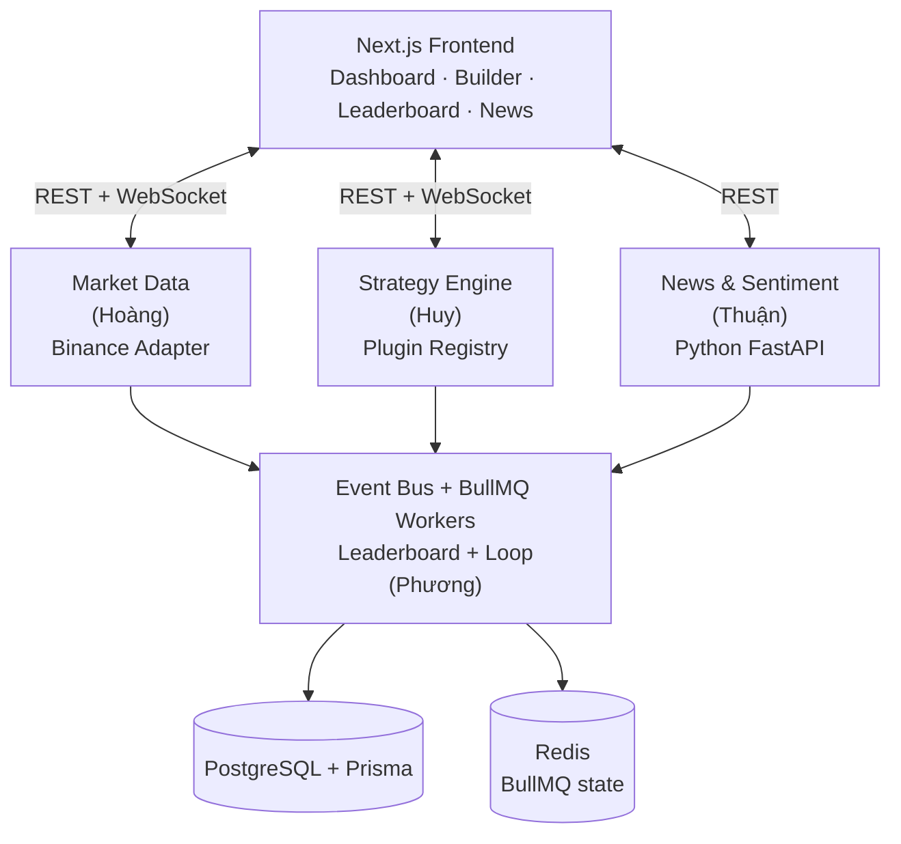

# System Architecture

## Architecture Style
**Modular Monolith**

> Rationale: 4 members / 4 weeks. A modular monolith gives clean module
> boundaries and independent development now, with the option to extract modules
> into services later if needed. Microservices would add infrastructure cost
> the team cannot afford within the timeline.

## High-Level Architecture Diagram



Modules depend on shared interfaces only — never on each other's implementations.

## Technology Stack
| Layer | Technology | Version | Notes |
|-------|-----------|---------|-------|
| Frontend | Next.js (TypeScript) | 15.x | App router dashboard, real-time via WebSocket, `lightweight-charts` for candlesticks |
| Backend | NestJS (TypeScript) | 11.x | Each NestJS module maps to a domain module. Built-in DI, EventEmitter2, WebSocket Gateway |
| Database | PostgreSQL + Prisma | 16 / 6.x | Type-safe ORM, JSONB for flexible strategy params. Connection pooling |
| Module communication | EventEmitter2 | n/a (NestJS built-in) | In-process typed event bus behind `IEventBus` interface (ADR-0005). Swap to Redis Pub/Sub later |
| Backtest queue | BullMQ + Redis | 5.x / 7.x | Durable `backtest` queue behind `IJobQueue`; priorities, retries, locks, and job retention (ADR-0013) |
| Extensibility | Strategy Registry + Adapter Pattern | n/a | Plugin arch for strategies (ADR-0003), adapters for data sources (ADR-0004) |
| Sentiment service | Python FastAPI | 0.115+ | Isolated process (ADR-0009); frontend never touches it directly. VADER sentiment model |
| Testing | Jest (backend) + Vitest (frontend) | 29.x / 2.x | Unit tests for business logic, integration tests for API endpoints |
| Monorepo | Turborepo | 2.x | `apps/backend` + `apps/frontend` + `libs/shared`. One `npm install`, one CI pipeline |

## Source Code Structure

```
crypto-strategy-lab/
├── apps/
│   ├── backend/                          # NestJS modular monolith
│   │   ├── src/
│   │   │   ├── shared/                   # Hoàng — shared infrastructure
│   │   │   │   ├── types/                # Candle, Trade, Signal...
│   │   │   │   ├── interfaces/           # IStrategy, IBacktester, IMarketDataAdapter, IEventBus, IJobQueue...
│   │   │   │   └── shared.module.ts
│   │   │   ├── market-data/             # Hoàng — Market Data module
│   │   │   │   ├── adapters/             # BinanceAdapter implements IMarketDataAdapter
│   │   │   │   ├── services/             # MarketDataService (caching, subscription dedup)
│   │   │   │   ├── websocket/            # MarketDataGateway (WS relay to frontend)
│   │   │   │   └── market-data.module.ts
│   │   │   ├── strategy/                # Huy — Strategy Engine (domain logic)
│   │   │   ├── news/                    # Thuận — News & Sentiment module
│   │   │   ├── events/                  # Phương — Event Bus (EventEmitter2 wrapper)
│   │   │   ├── queue/                   # Phương — BullMQ queue adapter + BacktestWorker
│   │   │   ├── leaderboard/             # Phương — Leaderboard (Observer)
│   │   │   ├── loop/                    # Phương — Strategy Loop Controller
│   │   │   ├── dashboard/              # Phương — BFF composition layer
│   │   │   └── database/               # Shared — Prisma schema + repositories
│   │   └── test/
│   ├── frontend/                        # Next.js application
│   │   └── src/
│   │       ├── app/                     # App router pages
│   │       ├── components/              # Chart, strategy, leaderboard, news, dashboard components
│   │       ├── hooks/                   # useWebSocket, useMarketData, useLeaderboard, useNews
│   │       └── services/                # REST + WebSocket API clients
│   └── sentiment/                       # Thuận — Python FastAPI sentiment service
│       ├── app.py
│       ├── analyzer.py
│       └── requirements.txt
├── libs/
│   └── shared/                          # Shared TypeScript types & interfaces
│       └── src/
│           ├── types/                   # Candle, Signal, BacktestResult...
│           ├── interfaces/              # IMarketDataAdapter, IStrategy, IEventBus...
│           └── events/                  # Event type definitions
├── kb/                                  # Knowledge Base
├── sdd_artifacts/                       # Per-feature SDD artifacts
├── docker-compose.yml                   # PostgreSQL + Redis (Redis AOF enabled for BullMQ)
├── package.json                         # Monorepo root
├── turbo.json                           # Turborepo config
└── README.md
```

## Communication Patterns
- **Client → Server**: REST API (JSON) + WebSocket for real-time charts
- **Module → Module**: EventEmitter2 events (typed events, see `contracts/events`)
- **Job dispatch**: BullMQ stores `BACKTEST` jobs in Redis; workers consume with configurable concurrency
- **External**: Binance REST + WebSocket adapters; news providers via adapters; NestJS → Python sentiment via HTTP

## Data Flow

### Realtime Market Data Flow (primary use case)
1. **Binance** → BinanceAdapter (WebSocket stream for `symbol@kline_timeframe`)
2. BinanceAdapter → MarketDataService (normalized `Candle` via `onCandle` callback)
3. MarketDataService → EventBus (publishes `MarketDataUpdated` — reserved for future consumers)
4. MarketDataService → MarketDataGateway (relays candle for WebSocket push)
5. MarketDataGateway → Frontend (emits `candle:update` or `candle:close` on `market-data:candles` channel)
6. Frontend `CandlestickChart` re-renders with the new/updated candle

> See `kb/flows/realtime-market-data.md` for full step-by-step flow with error handling.

### Strategy Backtest Flow (secondary use case)
1. User request → Strategy Engine; search candidate → Loop Controller. The producer generates `jobId` + `correlationId`, awaits `IJobQueue.enqueue()`, and receives confirmation only after BullMQ stores the prioritized job in Redis.
2. After durable enqueue, the producer publishes `BacktestRequested` as an observational notification (`source=USER` or `source=SEARCH_LOOP`); the queue does not subscribe to this Event. A BullMQ Worker then claims the Redis job.
3. Worker calls `IMarketDataService.getCandlesRange()` to fetch historical candles
4. Worker calls `IBacktester.run(strategy, candles, config)` → produces `Trade[]`
5. Worker calls `IEvaluator.evaluate(trades, capital)` → produces `EvaluationMetrics`
6. Worker persists `BacktestResult` and publishes `BacktestCompleted` with metrics; on terminal failure it publishes `BacktestFailed` exactly once
7. Leaderboard subscribes → updates Top-K ranking → publishes `LeaderboardUpdated`
8. WebSocket Gateway relays `LeaderboardUpdated` to frontend

> See `kb/flows/strategy-backtest.md` and `kb/flows/strategy-search-loop.md` for full flows.

### News & Sentiment Flow (parallel, independent)
1. Cron job triggers News Service → `INewsProvider` adapters collect articles
2. News Service normalizes + deduplicates → stores `NewsArticle` records
3. SentimentClient calls Python FastAPI `/analyze` → stores `SentimentScore`
4. `NewsSentimentStrategy` reads aggregate sentiment → returns BUY/SELL/HOLD signal
5. If Python service is down → `SentimentStrategy` returns HOLD (graceful degradation)

> See `kb/flows/news-sentiment-pipeline.md` for full flow.

## Security Model
- **Authentication**: None (course project, no user accounts)
- **Authorization**: n/a
- **Data protection**: External API keys in `.env` (never committed); rate-limit handling in adapters

## Deployment Topology

### Development (W1–W4)
- **Backend**: NestJS dev server (`npm run dev:backend`) — runs on `localhost:3001`
- **Frontend**: Next.js dev server (`npm run dev:frontend`) — runs on `localhost:3000`
- **Database**: PostgreSQL via `docker-compose up` — runs on `localhost:5432`
- **Queue store**: Redis via `docker-compose up` — runs on `localhost:6379` with AOF persistence
- **Sentiment Service**: Python FastAPI (`python -m uvicorn app:app`) — runs on `localhost:8000`
- **All application processes plus Redis/PostgreSQL** run locally. Turborepo orchestrates application startup; Docker Compose provides infrastructure.

### Production (if deployed for demo)
- **Option A (simplest)**: Single VPS running all processes via `docker-compose` (NestJS + Next.js + PostgreSQL + Redis + Python)
- **Option B (if needed)**: Vercel for Next.js frontend, Railway/Fly.io for NestJS backend, managed PostgreSQL and managed Redis
- **Not a concern for grading**: The spec focuses on architecture quality, not production deployment. Local dev is sufficient for the demo.

### Scalability Path
- BullMQ/Redis is the accepted durable queue backend (ADR-0013). Current workers remain in the NestJS process.
- If backtesting needs to scale from 100 → 100,000 candidates: first replace the process-local `IEventBus` transport, then run BullMQ workers as separate processes and scale them horizontally.
- If real-time data needs to scale: swap EventEmitter2 → Redis Pub/Sub (ADR-0005), extract Market Data as a separate service
- The modular monolith remains current; only the queue state is externalized to Redis.
