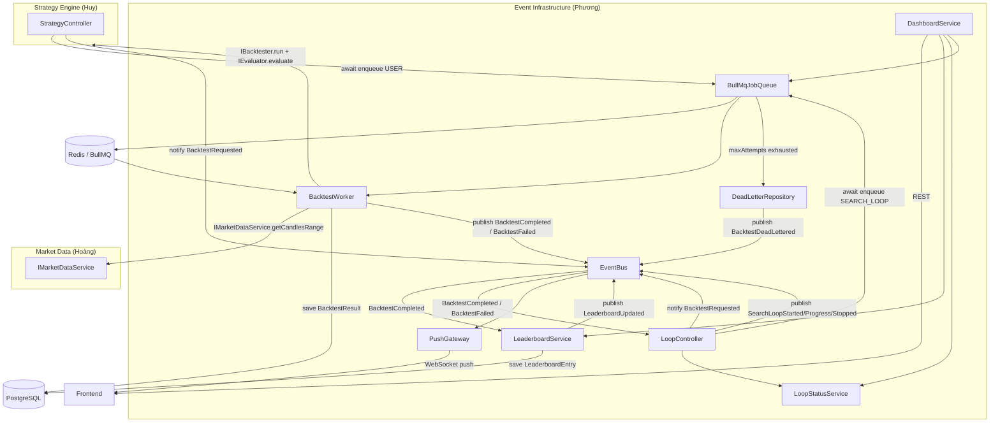
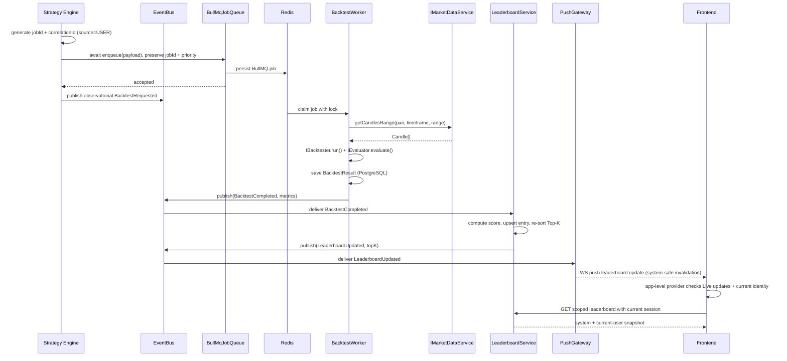
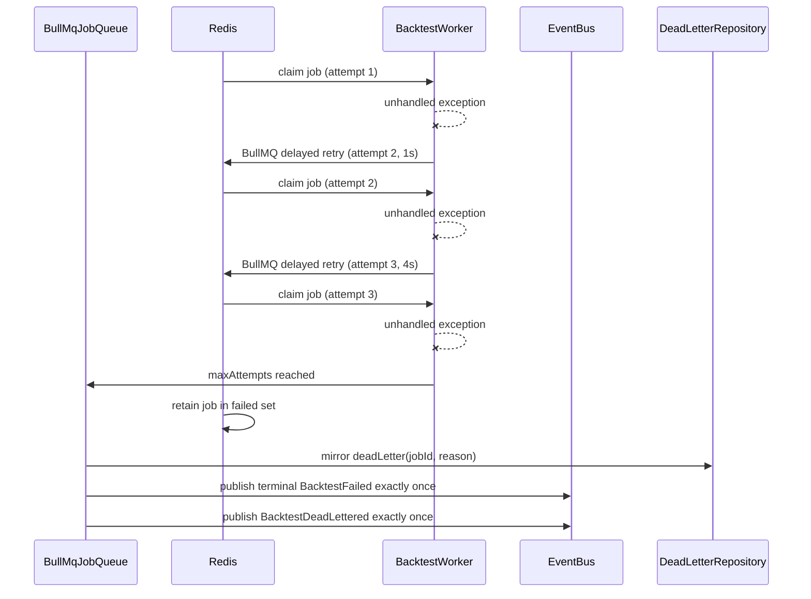
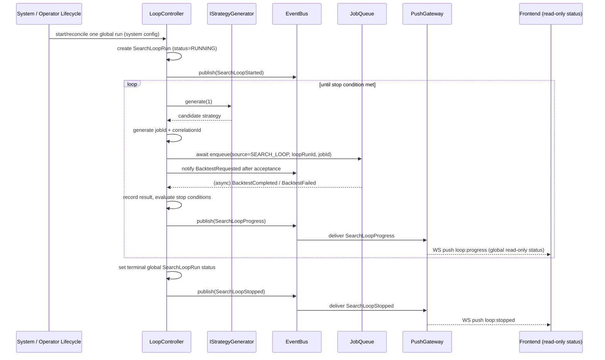

# Module: Event Infrastructure

> **Owner**: Phương
> **Status**: Active
> **Last Updated**: 2026-08-31

## 1. Overview
- **Responsibility**: The system's nervous system — event bus, Redis-backed BullMQ job queue, leaderboard, search loop orchestration, and dashboard BFF
- **Layer**: Backend
- **Depends on**: `IBacktester`, `IStrategyGenerator`, `IMarketDataService` (shared interfaces only — no direct imports of another module's implementation), BullMQ, Redis
- **Depended by**: All modules (publish/subscribe via `IEventBus`), Frontend (dashboard BFF, WebSocket)
- **Contracts**: `kb/contracts/events.yaml`
- **Source files**: `apps/backend/src/events/`, `queue/`, `leaderboard/`, `loop/`, `dashboard/`
- **Related ADRs**: ADR-0005 (Event-Driven Communication), ADR-0006 (Job Queue + Worker), ADR-0011 (Leaderboard as Observer), ADR-0013 (BullMQ/Redis Queue; supersedes ADR-0012), ADR-0017 (Persistent Supervisor for 24/7 Search Loop), ADR-0018 (Database-authoritative desired-state bootstrap), ADR-0019 (Search Loop operator allowlist)

## 2. Component Architecture

### Components
| Component | Responsibility | Pattern | File(s) |
|-----------|---------------|---------|---------|
| EventBus | Typed wrapper around EventEmitter2 — `publish()` / `subscribe()`, wraps payloads in `EventEnvelope` | Event-Driven / Mediator | `apps/backend/src/events/event-bus.ts` |
| Event Types | All typed event name + payload definitions (mirrors `kb/contracts/events.yaml`) | n/a | `libs/shared/src/events/index.ts` |
| BullMqJobQueue | `IJobQueue` adapter over BullMQ; Redis-backed priority/FIFO state, stats, retry, retention, and recovery | Job Queue/Worker | `apps/backend/src/queue/bullmq-job.queue.ts` |
| RedisConnection | Validates and owns BullMQ producer/worker Redis connections and shutdown lifecycle | Infrastructure Adapter | `apps/backend/src/queue/redis.connection.ts` |
| BacktestWorker | Consumes BullMQ jobs from Redis, calls `IMarketDataService` + `IBacktester` + `IEvaluator`, persists result, publishes `BacktestCompleted`/`BacktestFailed` | Worker | `apps/backend/src/queue/backtest.worker.ts` |
| DeadLetterRepository | Mirrors terminal BullMQ failures to PostgreSQL for stable audit/REST inspection and recovery | Repository | `apps/backend/src/queue/dead-letter.repository.ts` |
| LeaderboardService | Subscribes to `BacktestCompleted`, persists scored entries, reconciles ID-only source references at startup/every 5 minutes, computes caller-scoped REST rankings and a system-only event Top-K, publishes `LeaderboardUpdated` | Observer / Reconciler | `apps/backend/src/leaderboard/leaderboard.service.ts` |
| LeaderboardRepository | Persists/queries `LeaderboardEntry` rows | Repository | `apps/backend/src/leaderboard/leaderboard.repository.ts` |
| StrategyLoopService | Orchestrates the one global system search loop: generate → enqueue → collect → decide next step, entirely through events/interfaces and independently of browser lifecycle | Orchestrator / State Machine | `apps/backend/src/loop/strategy-loop.service.ts` |
| LoopStatusService | Tracks global `SearchLoopRun` state and exposes read-only progress for REST + WebSocket viewers | State Store | `apps/backend/src/loop/loop-status.service.ts` |
| SearchLoopSupervisorService | Seeds a missing control row before its first tick, logs ON/OFF transitions, then maintains 24/7 desired state by creating bounded runs, renewing the DB lease, replacing restart orphans, and applying retry backoff | Supervisor / Scheduler | `workspace/apps/backend/src/loop/search-loop-supervisor.service.ts` |
| SearchLoopControlRepository | Persists the singleton automation configuration, ON/OFF state, retry schedule, and cross-instance lease; `seedIfAbsent()` tolerates concurrent bootstrap and never overwrites an existing row | Repository / Lease | `workspace/apps/backend/src/loop/search-loop-control.repository.ts` |
| DashboardController / DashboardService | REST API composition for the frontend; leaderboard projections use current-user scope while loop/queue status remains global | BFF | `apps/backend/src/dashboard/dashboard.controller.ts`, `apps/backend/src/dashboard/dashboard.service.ts` |
| PushGateway | Relays privacy-safe `LeaderboardUpdated` invalidations and global loop progress on the existing infrastructure socket; it does not establish user rooms or socket auth | Gateway / Observer | `apps/backend/src/dashboard/push.gateway.ts` |
| App-level Leaderboard Live Provider (Frontend dependency) | Mounted below `AuthProvider` and `InfrastructureProvider`; owns cross-route Live updates preference/cache, current-session REST reconciliation, identity-generation invalidation, and exactly one `leaderboard:update` handler | Provider / Safe Invalidation Consumer | Frontend app root/provider layer |

### Component Diagram



## 3. Design Patterns

### Event-Driven Architecture — ADR-0005
- **Where**: `EventBus` — the channel for cross-module notifications and reactive side effects; acknowledged commands/queries use public interfaces such as `IJobQueue`
- **Why**: Strategy Engine, Market Data, News & Sentiment, and Event Infrastructure must evolve independently. A direct-call architecture (`LeaderboardService.update()` called from inside the Backtester) would force every module to import every other module's internals, which fails extensibility scenario #4 (100 → 100,000 backtests) and #7 (Binance disconnect must not affect the rest of the system).
- **How**: `EventBus` wraps NestJS's `EventEmitter2`. `publish(eventType, payload, correlationId?)` builds an `EventEnvelope` (adds `eventId`, `occurredAt`, generates a `correlationId` if none is passed) and emits it. `subscribe(eventType, handler)` registers a handler; the wrapper catches and logs handler exceptions so one failing subscriber can never break the publisher or a sibling subscriber. All event names and payload shapes are defined once in `kb/contracts/events.yaml` and mirrored in `event-types.ts` (compile-time typed via TypeScript discriminated unions keyed on `eventType`).
- **Trade-offs**:
  - Positive: modules are fully decoupled — Strategy Engine never imports anything from `leaderboard/` or `loop/`; a module can be deleted or replaced without touching publishers.
  - Positive: swapping `EventEmitter2` for Redis Pub/Sub later only requires re-implementing `IEventBus` — no consumer code changes (extensibility scenario for message-bus swap).
  - Negative: eventual consistency — there's a small window between `BacktestCompleted` and the Leaderboard reflecting it. Acceptable because the frontend gets `LeaderboardUpdated` over WebSocket instead of polling.
  - Negative: harder to trace than a direct call stack — mitigated by `correlationId` propagated through every event in a chain (`BacktestRequested` → `BacktestCompleted` → `LeaderboardUpdated`) and structured logging keyed on it.
  - Negative: the process-local event bus is still not durable. BullMQ makes accepted queue jobs durable, but it does not make `EventEmitter2` deliveries cross-process or replayable (see ADR-0013's topology constraint).

### Job Queue / Worker — ADR-0006 + ADR-0013
- **Where**: `BullMqJobQueue` + Redis + `BacktestWorker`, invoked through `IJobQueue.enqueue`
- **Why**: A single backtest can take seconds; the Strategy Engine's REST endpoint (`POST /api/strategies/backtest`) must return immediately (`202 Accepted`) instead of blocking the HTTP request thread. This is what lets the system scale from a handful of manual backtests to a search loop running thousands of candidates (extensibility scenario #4).
- **How**: Strategy Engine calls `IJobQueue.enqueue` for USER work; Loop Controller calls it for SEARCH_LOOP work. The producer UUID becomes BullMQ `jobId`. The call validates, rejects an existing ID, assigns priority `1` or `10`, and awaits Redis persistence before returning. The producer then publishes observational `BacktestRequested` with the same correlation identity; no queue subscriber acts on that Event. Equal-priority jobs are FIFO. A BullMQ `Worker` consumes with concurrency 3, calls `IMarketDataService.getCandlesRange()`, resolves the immutable strategy version, runs/evaluates, persists `BacktestResult`, then publishes `BacktestCompleted`. Retryable errors use three attempts with 1s/4s delays; terminal failures remain in BullMQ's failed set, mirror idempotently to `DeadLetterJob`, and publish terminal events exactly once.
- **Trade-offs**:
  - Positive: waiting and delayed jobs survive NestJS restarts while Redis remains available; BullMQ recovers stalled work.
  - Positive: retry + dead-letter queue means one bad candidate (e.g., a strategy that throws on malformed candle data) can't stall the whole search loop.
  - Positive: USER jobs have explicit higher priority than SEARCH_LOOP jobs; FIFO is preserved within a priority.
  - Negative: Redis is required for queue availability and must be monitored and persisted.
  - Constraint: workers remain in the NestJS process until `IEventBus` gains a cross-process transport; BullMQ alone does not carry domain events to process-local observers.

### Observer — ADR-0011
- **Where**: `LeaderboardService` subscribes to `BacktestCompleted`; `LoopController` also subscribes to `BacktestCompleted`/`BacktestFailed`
- **Why**: The Strategy Engine and the Job Queue worker must never know the Leaderboard or the Loop Controller exist. Ranking logic and search orchestration are reactive side effects of "a backtest finished" — not part of the backtest's own responsibility (Single Responsibility Principle applied across module boundaries).
- **How**: On startup, `LeaderboardModule` calls `eventBus.subscribe('BacktestCompleted', handler)`. The handler is idempotent on `backtestResultId`, computes `score`, and persists the nullable-owner entry. `strategyVersionId` and `backtestResultId` are logical ID references rather than database foreign keys. A startup and five-minute reconciler validates them through Strategy Engine's public `IBacktestResultPort`, deletes only confirmed missing/mismatched projections, keeps rows when the port check fails transiently, then reranks survivors. Caller-scoped REST reads also exclude invalid sources before ranking/Top-K; the handler publishes `LeaderboardUpdated` with only the system Top-K so the namespace-wide payload is a safe invalidation.
- **Trade-offs**:
  - Positive: adding a second observer (e.g., a future "Strategy Performance Alerts" module) requires zero changes to the Job Queue or Strategy Engine — just another `subscribe('BacktestCompleted', ...)` call.
  - Positive: changing the scoring formula only touches `LeaderboardService` — Backtester and Evaluator are untouched (extensibility scenario #4/#6 from the spec).
  - Negative: multiple observers processing the same event independently means no shared transaction — if `LeaderboardService` succeeds but `LoopController`'s handler throws, the loop's view of progress can lag. Mitigated by keeping each handler idempotent and side-effect-isolated (Section 8).

### BFF (Backend-for-Frontend)
- **Where**: `DashboardService` / `DashboardController`
- **Why**: The frontend dashboard needs leaderboard + loop status + queue health in shapes convenient for rendering, without knowing that they come from three internal services owned by the same module.
- **How**: `DashboardService` receives the identity verified under `kb/contracts/auth.yaml`, obtains a leaderboard projection scoped before Top-K/rank/`updatedAt` calculation (anonymous = system only; A = system + A), and composes it with global `LoopStatusService.getCurrent()` plus global queue stats. A private entry outside the caller scope is never fetched and cannot influence exposed metadata.
- **Trade-offs**: Positive — frontend makes one call instead of three; Negative — `DashboardService` has a small amount of coupling to the shape of all three sub-services, acceptable since all four live in the same module.

### Cross-route Safe Invalidation Provider
- **Where**: Frontend root tree below both `AuthProvider` and `InfrastructureProvider`, above route consumers such as Dashboard and Leaderboard.
- **Why**: Dashboard mount lifetime is shorter than application/session lifetime. Owning state in a page hook would miss events off-route, reset OFF on navigation, and allow duplicate listeners.
- **How**: The provider owns Live updates state, caller-scoped cache, request generation, and one exact `leaderboard:update` handler while ON. The user's choice is browser-persisted (`crypto-strategy-lab:leaderboard-live`) and defaults to OFF when absent. The namespace-wide event is only a system-safe invalidation; ON refetches REST with the current session even when Dashboard is absent. OFF removes the exact handler and freezes the snapshot across navigation/reload/restart/reconnect. Only explicit user action changes the choice.
- **Identity boundary**: Before A → B or A → anonymous renders, clear A's cache, abort/invalidate A requests, advance the request generation, then fetch for the new session. Late responses from the old identity are discarded.
- **Constraint**: Keep the existing socket/channel wire contract. Do not add rooms, socket handshake/auth, namespace changes, client privacy filtering, or private data to the broadcast payload.

## 4. Internal Data Flow

```
Strategy Engine (source=USER) / Loop Controller (source=SEARCH_LOOP)
        │  generate jobId + correlationId; await IJobQueue.enqueue
        ▼
     BullMqJobQueue → Redis ────────────────────────────────┐
        │                                                     │
        ▼                                                     │
     return queued; publish notification (does not drive Worker)│
        │                                                     │
        ▼                                                     │
   BacktestWorker (pulled from pool)                          │
        │  1. IMarketDataService.getCandlesRange(pair, tf, range)
        │  2. StrategyRegistry.get(strategyVersionId)          │
        │  3. IBacktester.run(strategy, candles, config)       │
        │  4. IEvaluator.evaluate(trades, capital)             │
        │  5. save BacktestResult → PostgreSQL                 │
        ▼                                                     │
   success? ──yes──▶ publish('BacktestCompleted', {...}) ─────┘
        │
        no (exception)
        ▼
   attempt < maxAttempts? ──yes──▶ BullMQ delayed retry
        │
        no
        ▼
   terminal failure → publish('BacktestFailed') exactly once
        │
        └── if moved to DLQ → publish('BacktestDeadLettered') exactly once

   ───────────────────────────────────────────────────────────

   EventBus: 'BacktestCompleted' delivered to two independent subscribers

   ┌─────────────────────────┐        ┌───────────────────────────┐
   │  LeaderboardService     │        │  LoopController            │
   │  1. compute score       │        │  1. record result for      │
   │  2. upsert entry        │        │     current loopRunId      │
   │  3. re-sort, trim Top-K │        │  2. check stop conditions  │
   │  4. publish             │        │  3. generate next candidate│
   │     LeaderboardUpdated  │        │     or publish              │
   └───────────┬─────────────┘        │     SearchLoopStopped       │
               │                      └──────────────┬──────────────┘
               ▼                                     ▼
          PushGateway ───────── WebSocket ─────▶ Frontend
```

## 5. Sequence Diagrams

### Backtest Request → Completion → Leaderboard Update



### Job Retry and Dead-Letter



### Global System Search Loop Iteration



Navigation, Dashboard mount/unmount, authentication transitions, and leaderboard Live updates ON/OFF do not appear as loop commands in this sequence. They never control the global process.

## 6. Data Model
| Entity | Fields | Relationships |
|--------|--------|---------------|
| LeaderboardEntry | `id (UUID, PK)`, `userId (UUID, nullable; null = system)`, `strategyVersionId (UUID, logical reference)`, `backtestResultId (UUID, UNIQUE, logical reference)`, `rank (int)`, `score (float)`, `totalReturn (float)`, `winRate (float)`, `maxDrawdown (float)`, `sharpeRatio (float)`, `totalTrades (int)`, `createdAt`, `updatedAt` | Denormalized Event Infrastructure read model. Both source IDs refer logically to Strategy Engine records but intentionally have no database FK/relation. Source validity is reconciled through `IBacktestResultPort`; confirmed orphans are deleted and remaining entries reranked. |
| SearchLoopRun | `id (UUID, PK)`, `status (enum: RUNNING\|PAUSED\|COMPLETED\|STOPPED_BY_USER\|FAILED)`, `generatorType (enum: RANDOM\|DOMAIN_GUIDED)`, `iteration (int)`, `testedCandidates (int)`, `maxCandidates (int, nullable)`, `maxDurationMs (int, nullable)`, `stopOnNoImprovementIterations (int, default 50)`, `currentCandidateStrategyVersionId (UUID, nullable)`, `bestStrategyVersionId (UUID, nullable)`, `bestScore (float, nullable)`, `stopReason (string, nullable)`, `startedAt`, `pausedAt (nullable)`, `stoppedAt (nullable)` | One-to-many → `SearchLoopCandidate` |
| SearchLoopCandidate | `id (UUID, PK)`, `loopRunId (FK)`, `strategyVersionId (UUID, logical reference)`, `backtestResultId (UUID, nullable logical reference)`, `iteration (int)`, `score (float, nullable)`, `status (enum: GENERATING\|BACKTESTING\|EVALUATED\|FAILED)`, `createdAt` | Database FK/many-to-one only to Event Infrastructure-owned `SearchLoopRun`; Strategy Engine source IDs are logical references with no Prisma relation. |
| SearchLoopControl | Singleton `id="system"`, `enabled`, generator/pair/timeframe, rolling `backtestWindowDays`, backtest config, per-run bounds, `cooldownMs`, `failureCount`, `nextRunAt`, `lastStartedRunId`, `lastError`, `leaseOwner`, `leaseUntil`, timestamps | Persistent desired state for ADR-0017/ADR-0018. It is seeded from the environment only when absent, owns no candidate/result data, and has no user ownership. |
| DeadLetterJob | `id (UUID, PK)`, `jobId (UUID)`, `jobType (string)`, `payload (JSONB)`, `attempts (int)`, `lastError (string)`, `deadLetteredAt`, `resolvedAt (nullable)` | Standalone — inspected via `GET /api/queue/dead-letter` |

> `LeaderboardEntry` and `SearchLoopRun`/`SearchLoopCandidate` live in tables owned by Event Infrastructure. `LeaderboardEntry.userId` implements the existing nullable ownership model; no migration or new ownership field is introduced by this KB update. `SearchLoopRun` and `SearchLoopCandidate` remain global system data and never gain per-user ownership. Cross-module references remain by ID only per `kb/MODULES.md` Rule 2; application-level reconciliation, not a cross-module database FK, owns orphan cleanup.

## 7. API Surface
See `kb/contracts/events.yaml` for event payloads. REST + WebSocket surface owned by this module:

### REST
| Method | Path | Description | Response |
|--------|------|--------------|----------|
| GET | `/api/leaderboard` | Caller-scoped Top-K, sortable; scope/rank/`updatedAt` are computed before projection | `{ rankingCriterion, updatedAt, entries: LeaderboardEntryPayload[] }` |
| GET | `/api/leaderboard?sortBy=sharpeRatio` | Re-rank the caller-visible system + current-user dataset; no backtest rerun | same shape as above |
| GET | `/api/leaderboard/:strategyVersionId` | Caller-scoped detail; out-of-scope private data is indistinguishable from not found | `LeaderboardEntryPayload & { trades: Trade[] }` |
| POST | `/api/loop/start` | Operator-only global lifecycle mutation; not called by Live updates or route UI | `{ loopRunId, status: "RUNNING" }` |
| POST | `/api/loop/:loopRunId/pause` | Operator-only global lifecycle mutation | `{ loopRunId, status: "PAUSED" }` |
| POST | `/api/loop/:loopRunId/resume` | Operator-only global lifecycle mutation | `{ loopRunId, status: "RUNNING" }` |
| POST | `/api/loop/:loopRunId/stop` | Operator-only global lifecycle mutation | `{ loopRunId, status: "STOPPED_BY_USER" }` |
| GET | `/api/loop/:loopRunId` | Current status/progress of a loop run | `SearchLoopRun` shape |
| GET | `/api/loop/current` | Status of the currently active loop run, if any | `SearchLoopRun \| null` |
| GET | `/api/loop/control` | Read persisted global automation desired state | `SearchLoopControl` |
| POST | `/api/loop/control/enable` | Operator-only enable/update; persists config and asks the supervisor to start when eligible | `SearchLoopControl` |
| POST | `/api/loop/control/disable` | Operator-only persistent disable; stops the active run and prevents replacements after restart | `SearchLoopControl` |
| PUT | `/api/loop/control/config` | Operator-only configuration update; the current run is unchanged and the next run uses the new config | `SearchLoopControl` |
| GET | `/api/queue/stats` | Queue depth, in-flight, dead-letter counts | `QueueStats` (see `kb/contracts/events.yaml`) |
| GET | `/api/queue/dead-letter` | List dead-lettered jobs for operator inspection | `DeadLetterJob[]` |
| POST | `/api/queue/dead-letter/:jobId/retry` | Re-enqueue a dead-lettered job | `{ jobId, status: "QUEUED" }` |
| GET | `/api/dashboard/summary` | BFF composite: caller-scoped leaderboard Top-5 + global loop status + global queue health | `{ leaderboard, loop, queue, generatedAt }`; dependency failures use stable `{ error, code }` bodies from `sdd_artifacts/event-infrastructure-dashboard/contracts/dashboard-realtime.md` |

### WebSocket (channels pushed by `PushGateway`)
Namespace: `/infrastructure` by default, configurable at process/module bootstrap with `INFRASTRUCTURE_WS_NAMESPACE`. This namespace is independent from the existing `market-data` namespace.

| Channel | Event payload | Trigger |
|---------|---------------|---------|
| `leaderboard:update` | Existing `LeaderboardUpdated` wire payload: system-only `topK`, nullable private trigger ID | Safe invalidation for the app-level provider; while ON it refetches scoped REST |
| `loop:started` | `SearchLoopStarted` payload | Loop start |
| `loop:progress` | `SearchLoopProgress` payload | After every candidate evaluation |
| `loop:stopped` | `SearchLoopStopped` payload | Loop completes/stops/fails |
| `connection:status` | `{ status: "connected" \| "reconnecting" }` | On connect/reconnect (client-side, mirrors DESIGN.md realtime UX rules) |

## 8. Quality Attributes
- **Security**: Leaderboard REST uses `SupabaseJwtGuard`/`@CurrentUser()` semantics from `kb/contracts/auth.yaml`: anonymous sees system rows; A sees system + A. Filtering precedes Top-K, ranks, detail lookup, and timestamp calculation. Namespace-wide `leaderboard:update` never contains private rows; clients refetch instead of applying a privacy filter. Loop/queue status remains global and read-only. Every global Search Loop mutation requires a verified user ID in the comma-separated `SEARCH_LOOP_OPERATOR_USER_IDS` allowlist; the empty default denies all mutations.
- **Performance**: BullMQ worker concurrency is configurable (default 3). USER priority prevents the global search loop from indefinitely delaying interactive work. Scoped leaderboard indexes/queries bound work before Top-K projection; an event causes at most one app-provider reconciliation path rather than one handler per mounted route.
- **Reliability**: Redis AOF plus BullMQ durable job state, three total attempts with 1s/4s retry delays, stalled-job recovery, graceful worker shutdown, and PostgreSQL dead-letter audit (`kb/contracts/events.yaml`). Worker side effects and subscribers are idempotent because stalled/redelivered jobs can execute at least once. The Search Loop desired state survives restart in `SearchLoopControl`; a 15-second supervisor renews a 60-second PostgreSQL lease, replaces lost runtime context with a fresh bounded run, and backs start failures off up to 30 minutes. Leaderboard source references are checked on startup and every five minutes. EventEmitter2 remains process-local and is not claimed as a durable cross-process event log.
- **Observability**: `correlationId` propagates through `BacktestRequested → BacktestCompleted/Failed → LeaderboardUpdated` and through `SearchLoopStarted → BacktestRequested → SearchLoopProgress → SearchLoopStopped`, enabling full request tracing in logs. `GET /api/queue/stats` and `GET /api/dashboard/summary` expose live counts (queued, processing, dead-lettered, current loop iteration) so the demo can show "Loop is running: 125 candidates tested" without inspecting logs.
- **Scalability**: BullMQ/Redis is the accepted target (ADR-0013). Increasing in-process concurrency is configuration-only. Horizontal worker processes additionally require replacing the process-local `IEventBus`; this prerequisite must be completed before claiming multi-process completion-event delivery.

## 9. Testing Strategy
- **Unit tests**:
  - `EventBus`: publish wraps payload in a valid `EventEnvelope`; a throwing subscriber does not affect other subscribers or the publisher.
  - `BullMqJobQueue`/`BacktestWorker`: enqueue preserves `jobId`; duplicate IDs conflict; USER priority and equal-priority FIFO hold; attempts/delays are correct; retention is bounded; terminal failures mirror once to `DeadLetterJob`; `getStats()` maps BullMQ states correctly.
  - `LeaderboardService`: score computation is correct for known inputs; duplicate `BacktestCompleted` (same `backtestResultId`) does not create a duplicate entry; Top-K trimming keeps exactly K entries sorted correctly; cleanup removes confirmed orphan/mismatched references, skips transient lookup failures, deduplicates overlapping runs, and reranks survivors.
  - `LeaderboardService`/BFF reads: anonymous, A, and B isolation is applied before Top-K/rank/`updatedAt`; out-of-scope detail returns not found.
  - App-level provider: default OFF without stored choice; explicit ON/OFF persistence across remount/reload; one handler while ON; OFF snapshot freeze across navigation/reload/reconnect; exact cleanup; and A → B/A → anonymous cache/request invalidation before render.
  - `StrategyLoopService`: system-configured bounds and restart reconciliation work without a mounted browser; navigation/toggle tests assert zero loop lifecycle calls and no per-user run state.
  - `SearchLoopSupervisorService`: disabled/leased-away no-op, rolling windows, one active run, restart-orphan replacement, persisted cooldown, exponential retry, and concurrent-disable compensation.
- **Integration tests**:
  - Redis-backed queue flow: await `IJobQueue.enqueue` with Redis and Strategy/Market Data test doubles, publish the notification, and assert the BullMQ job is consumed and `BacktestCompleted` is correct.
  - Restart recovery: enqueue waiting/delayed jobs, restart NestJS without stopping Redis, and assert jobs resume without changing identity.
  - Stalled/idempotency path: simulate worker loss and prove recovered execution does not duplicate `BacktestResult`, terminal events, or dead-letter records.
  - Dashboard/Infrastructure realtime: boot production behavior, verify `leaderboard:update` remains system-safe, and prove the app-level consumer treats it as invalidation followed by current-session REST even when Dashboard is not mounted.
  - Leaderboard reconciliation: remove a source `BacktestResult`, invoke cleanup, and assert its projection is removed while surviving rows are reranked without accessing another module's Prisma delegates.
  - Cross-route/identity integration: navigate Dashboard ↔ Leaderboard with ON and OFF, reconnect in each state, then switch A → B and A → anonymous; assert one-or-zero listener as selected, no stale request commit, and no A data in the new viewer cache.
  - Full search loop: start the global system loop with `maxCandidates: 5` against test doubles → assert exactly 5 `BacktestRequested` events with `userId: null`, terminal completion, and no dependency on navigation or Live updates.
  - Dead-letter path: force `IBacktester.run()` to throw on every attempt → assert the job ends in `DEAD_LETTER` status and both `BacktestFailed` and `BacktestDeadLettered` are published exactly once.
- **Manual/demo verification**: enqueue jobs, restart NestJS while Redis stays up, and show waiting work resumes; demonstrate USER priority, retry/backoff, DLQ recovery, Redis outage/recovery, and WebSocket reconnection.

## 10. Open Questions / TODOs
- [x] ~~Confirm `BacktestRequested`/`BacktestCompleted` field ownership split with Huy.~~ **Resolved 2026-08-09** — `kb/contracts/events.yaml` is the sole event-payload SSoT; Strategy Engine owns `BacktestConfig` and `EvaluationMetrics`, while Event Infrastructure owns envelope/routing metadata. — Owner: Phương + Huy
- [x] ~~Resolve `BacktestFailed` publisher mismatch.~~ **Resolved 2026-08-09** — Event Infrastructure's Job Queue Worker is the sole publisher of the exactly-once terminal event; Strategy Engine and Loop Controller consume it. — Owner: Phương + Huy
- [x] ~~Confirm Prisma schema/table ownership for `LeaderboardEntry`, `SearchLoopRun`, `SearchLoopCandidate`, `DeadLetterJob`.~~ **Resolved 2026-08-09** — Hoàng handles all Prisma model definitions (owns `shared/` + Prisma schema). Phương defines entity shapes in this file; Hoàng translates them into `schema.prisma`. — Owner: Hoàng
- [x] ~~Decide queue priority.~~ **Resolved 2026-08-12** — BullMQ priority `1` for USER and `10` for SEARCH_LOOP; FIFO within equal priority. — Owner: Phương
- [ ] Confirm final leaderboard scoring formula and default Top-K value with the team (see `kb/flows/leaderboard-update.md` Business Rules). — Owner: Phương
- [ ] Confirm whether `NewsCollected` will actually be published in W2+ (currently reserved/unused) — see `kb/contracts/events.yaml`. — Owner: Thuận
