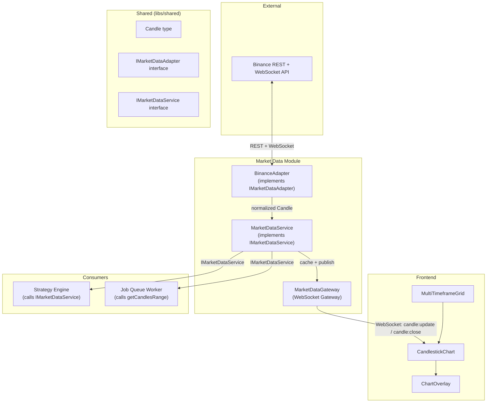
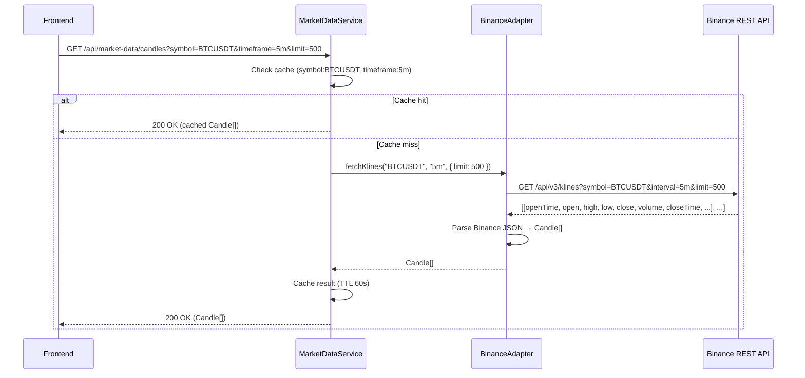
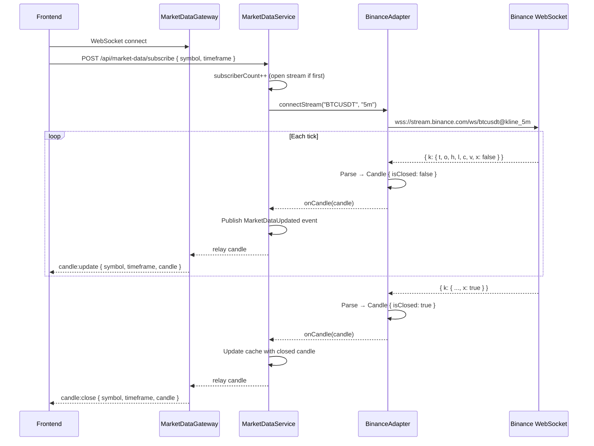

# Module: Market Data

> **Owner**: Hoàng
> **Status**: Active
> **Last Updated**: 2026-08-07

## 1. Overview
- **Responsibility**: Ingest historical + real-time crypto market data from Binance, normalize it into the system's `Candle` format, cache it, and relay it to the frontend and other modules through REST, WebSocket, and the event bus
- **Layer**: Backend (NestJS module) + Frontend (chart components, hooks)
- **Depends on**: `shared/` types and interfaces (owned by Hoàng — foundational module, no other module dependencies)
- **Depended by**: Strategy Engine (consumes `IMarketDataService` for historical candles), Event Infrastructure (Job Queue worker calls `IMarketDataService.getCandlesRange()` for backtesting), Frontend (WebSocket candle stream + REST)
- **Contracts**: `kb/contracts/market-data.yaml`
- **Source files**:
  - Backend: `apps/backend/src/market-data/adapters/binance.adapter.ts`, `apps/backend/src/market-data/adapters/market-data.adapter.interface.ts`, `apps/backend/src/market-data/services/market-data.service.ts`, `apps/backend/src/market-data/websocket/market-data.gateway.ts`, `apps/backend/src/market-data/market-data.module.ts`
  - Shared: `libs/shared/src/types/candle.ts`, `libs/shared/src/interfaces/imarket-data-adapter.ts`, `libs/shared/src/interfaces/imarket-data-service.ts`
  - Frontend: `apps/frontend/src/components/chart/CandlestickChart.tsx`, `apps/frontend/src/components/chart/MultiTimeframeGrid.tsx`, `apps/frontend/src/components/chart/ChartOverlay.tsx`, `apps/frontend/src/hooks/useWebSocket.ts`, `apps/frontend/src/hooks/useMarketData.ts`
- **Related ADRs**: ADR-0002 (Modular Monolith), ADR-0004 (Adapter Pattern for Data Sources), ADR-0007 (Auto-Reconnect for External APIs)

## 2. Component Architecture

### Components
| Component | Responsibility | Pattern | File(s) |
|-----------|---------------|---------|---------|
| BinanceAdapter | Calls Binance REST API for historical klines, opens Binance WebSocket for real-time streams, parses Binance-specific JSON into normalized `Candle`, handles auto-reconnect | Adapter | `market-data/adapters/binance.adapter.ts` |
| MarketDataService | Caches historical candles, manages subscription deduplication (multiple frontend clients share one stream), publishes `MarketDataUpdated` events, exposes `IMarketDataService` to other modules | Facade + Caching | `market-data/services/market-data.service.ts` |
| MarketDataGateway | NestJS WebSocket Gateway — relays live candle data and connection status to connected frontend clients | Gateway | `market-data/websocket/market-data.gateway.ts` |
| CandlestickChart | Renders candlestick chart using `lightweight-charts`, subscribes to WebSocket updates | Frontend component | `frontend/components/chart/CandlestickChart.tsx` |
| MultiTimeframeGrid | Manages 4 independent chart panels, each with its own pair/timeframe selector | Frontend component | `frontend/components/chart/MultiTimeframeGrid.tsx` |
| ChartOverlay | Renders MA, Bollinger Bands, Support/Resistance zones, buy/sell signal markers on top of candlestick chart | Frontend component | `frontend/components/chart/ChartOverlay.tsx` |

### Component Diagram



## 3. Design Patterns

### Adapter Pattern — IMarketDataAdapter
- **Where**: BinanceAdapter (implements `IMarketDataAdapter`). Future: OKXAdapter, BybitAdapter.
- **Why**: The spec (Section 4) requires that the frontend and strategy engine never depend on Binance's data format. Different exchanges have different REST endpoints, rate limits, and WebSocket message formats. The adapter normalizes all of them into the system's `Candle` entity. See ADR-0004.
- **How**: `BinanceAdapter` implements `fetchKlines()` (Binance REST `GET /api/v3/klines`), `connectStream()` (Binance WebSocket `<symbol>@kline_<interval>`), and `onCandle()` (parses Binance's `k.t`, `k.o`, `k.h`, `k.l`, `k.c`, `k.v`, `k.x` fields into `Candle`). `MarketDataService` receives `IMarketDataAdapter` via NestJS DI — it never knows which exchange is active.
- **Trade-offs**: Gains — swappable data sources (1 new class for OKX, zero changes elsewhere). Loses — every adapter must implement the full interface even if an exchange doesn't support all features.

### Caching (In-Memory)
- **Where**: MarketDataService
- **Why**: Binance REST API has rate limits (1200 requests/min). Multiple frontend clients requesting the same pair/timeframe should not trigger multiple REST calls.
- **How**: LRU cache keyed on `symbol:timeframe`. Historical candles are cached with a TTL of 1 minute (live candles update via WebSocket, not REST). Cache invalidates when a new candle closes (WebSocket `candle:close` event).
- **Trade-offs**: Gains — reduced API calls, faster response. Loses — stale data possible within the TTL window (acceptable — WebSocket updates provide real-time data; REST cache is only for initial load and backtesting).

### Subscription Deduplication
- **Where**: MarketDataService
- **Why**: If 3 frontend clients each open BTCUSDT 5m, the system should open 1 Binance WebSocket stream, not 3.
- **How**: `Subscription` records track `subscriberCount` per `symbol:timeframe`. `subscribe()` increments the counter (opens a stream if count goes 0 → 1). `unsubscribe()` decrements (closes the stream when count goes 1 → 0).
- **Trade-offs**: Gains — efficient resource usage. Loses — if the WebSocket drops, all subscribers are affected simultaneously (mitigated by auto-reconnect, ADR-0007).

## 4. Internal Data Flow

### Historical Data Request (REST)
1. Frontend or Job Queue calls `MarketDataService.getCandles(symbol, timeframe, limit)`
2. MarketDataService checks in-memory cache → if hit, return cached candles
3. If miss, MarketDataService calls `BinanceAdapter.fetchKlines(symbol, timeframe, { limit })`
4. BinanceAdapter calls Binance REST API `GET /api/v3/klines?symbol=BTCUSDT&interval=5m&limit=500`
5. BinanceAdapter parses Binance JSON response → `Candle[]` (maps `k.t` → `openTime`, `k.c` → `close`, etc.)
6. MarketDataService caches the result and returns `Candle[]`

### Real-Time Data Flow (WebSocket)
1. Frontend calls `POST /api/market-data/subscribe` with `{ symbol, timeframe }`
2. MarketDataService.subscribe() — if no existing stream, calls `BinanceAdapter.connectStream(symbol, timeframe)`
3. BinanceAdapter opens WebSocket to Binance: `wss://stream.binance.com:9443/ws/btcusdt@kline_5m`
4. Binance sends kline updates → BinanceAdapter parses → calls registered `onCandle` callback
5. MarketDataService receives candle → publishes `MarketDataUpdated` event on `IEventBus` (for future event-driven consumers)
6. MarketDataGateway receives the candle → emits `candle:update` (if `isClosed: false`) or `candle:close` (if `isClosed: true`) to connected frontend clients via WebSocket
7. Frontend `CandlestickChart` updates the last candle (if forming) or appends a new candle (if closed)

## 5. Sequence Diagrams

### Fetch Historical Candles



### Real-Time Candle Stream



## 6. Data Model

Entities owned by this module (defined in `kb/contracts/market-data.yaml`):

| Entity | Fields | Relationships |
|--------|--------|---------------|
| Candle | `symbol`, `timeframe`, `openTime`, `closeTime`, `open`, `high`, `low`, `close`, `volume`, `isClosed` | Core data unit — consumed by Strategy Engine (for analysis + backtesting) and Frontend (for charts) |
| TradingPair | `symbol`, `baseAsset`, `quoteAsset`, `isActive` | Static reference data — available trading pairs |
| Subscription | `symbol`, `timeframe`, `subscribedAt`, `subscriberCount` | Runtime state — tracks active WebSocket streams |

### Prisma Schema (owned by Hoàng)
```prisma
model Candle {
  id          Int      @id @default(autoincrement())
  symbol      String
  timeframe   String
  openTime    DateTime
  closeTime   DateTime
  open        Float
  high        Float
  low         Float
  close       Float
  volume      Float
  isClosed    Boolean

  @@unique([symbol, timeframe, openTime])
  @@index([symbol, timeframe, openTime])
}

model TradingPair {
  id          Int      @id @default(autoincrement())
  symbol      String   @unique
  baseAsset   String
  quoteAsset  String
  isActive    Boolean  @default(true)
}
```

> Note: `Candle` is persisted for backtesting and historical analysis. Real-time forming candles (`isClosed: false`) are not persisted — only closed candles are written to the database.

## 7. API Surface

Full API documented in `kb/contracts/market-data.yaml`. Summary:

| Method | Path | Purpose | Consumer |
|--------|------|---------|----------|
| GET | `/api/market-data/candles` | Fetch historical candles | Frontend, Job Queue Worker |
| GET | `/api/market-data/pairs` | List available trading pairs | Frontend (pair selector) |
| GET | `/api/market-data/subscriptions` | List active streams | Frontend (status panel) |
| POST | `/api/market-data/subscribe` | Start real-time stream | Frontend |
| POST | `/api/market-data/unsubscribe` | Stop real-time stream | Frontend |
| WS | `market-data:candles` | Live candle updates | Frontend (CandlestickChart) |
| WS | `market-data:status` | Connection status | Frontend (StatusIndicator) |
| Event | `MarketDataUpdated` | New/updated candle on event bus | Future consumers (currently no bus subscribers) |

## 8. Quality Attributes
- **Security**: API keys for Binance stored in `.env` (never committed). No user authentication (course project). Rate limit headers from Binance are respected — the adapter backs off when approaching limits.
- **Performance**: In-memory LRU cache for historical candles (TTL 60s). WebSocket for real-time (no polling). Binance REST calls only on cache miss. Prisma connection pooling for database queries.
- **Error handling**: Auto-reconnect with exponential backoff for WebSocket drops (ADR-0007). If Binance REST returns 429 (rate limited), the adapter waits and retries. If REST returns 5xx, the adapter retries up to 3 times. Frontend receives `status:disconnected` → `status:reconnected` events so the UI shows connection state.
- **Reliability**: Spec Section 32.4 asks "if Binance disconnects, how does the system recover?" Answer: BinanceAdapter detects the WebSocket drop, automatically reconnects with exponential backoff (1s, 4s, 16s), and the frontend shows a "reconnecting" indicator. No candles are lost during the gap — the adapter fetches missed candles via REST on reconnect.

## 9. Testing Strategy
- **Unit tests**:
  - `BinanceAdapter.parseKline()` — verify Binance JSON → Candle mapping (field names, types, isClosed flag)
  - `MarketDataService.getCandles()` — verify cache hit/miss behavior
  - `MarketDataService.subscribe()` — verify subscription deduplication (2 calls → 1 stream)
  - `MarketDataService.unsubscribe()` — verify stream closure when subscriberCount reaches 0
- **Integration tests**:
  - Binance REST API call with a real (or mocked) endpoint → verify Candle[] returned
  - WebSocket stream → verify `candle:update` and `candle:close` events emitted
  - Auto-reconnect: simulate WebSocket drop → verify reconnect + status events
- **Mock strategy**: `IMarketDataAdapter` is mocked in `MarketDataService` tests. Binance API is not called in unit tests — only in integration tests with a test API key or a mock HTTP server.

## 10. Open Questions / TODOs
- [x] ~~Candle field names —~~ **Resolved**. `Candle` entity defined in `kb/contracts/market-data.yaml` with fields matching `events.yaml`'s `MarketDataUpdated` payload.
- [x] ~~Confirm REST endpoint paths and params —~~ **Resolved**. 5 REST endpoints + 2 WebSocket channels documented in contract.
- [x] ~~IMarketDataAdapter interface methods —~~ **Resolved**. 6 methods: `fetchKlines`, `connectStream`, `disconnectStream`, `onCandle`, `onDisconnect`, `onReconnect`.
- [x] ~~ADR-0007 (Auto-Reconnect) —~~ **Resolved**. Written ahead of schedule. Details: exponential backoff (1s, 4s, 16s, max 3 attempts), REST gap recovery on reconnect, frontend status notifications. See `kb/ADR/0007-auto-reconnect-for-external-apis.md`.
- [ ] Confirm whether `lightweight-charts` (TradingView) or `recharts` is used for the frontend candlestick chart — decided during W1 frontend scaffold (current plan: `lightweight-charts`).
