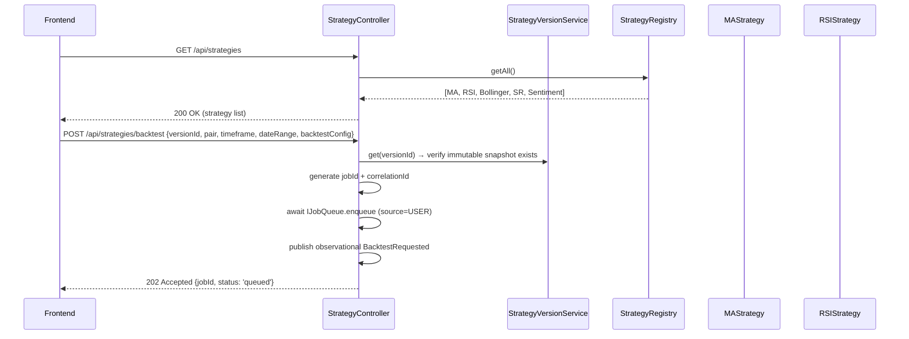
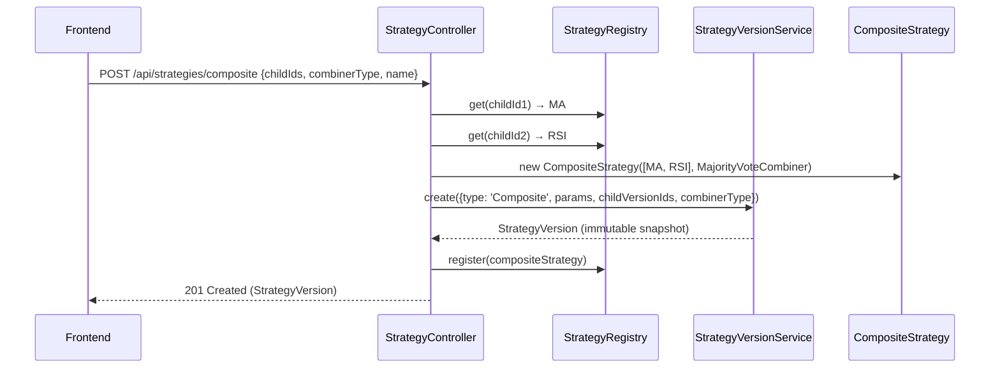
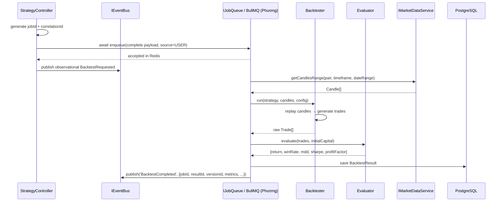

# Module: Strategy Engine

> **Owner**: Huy
> **Status**: Active
> **Last Updated**: 2026-08-09

## 1. Overview
- **Responsibility**: Register, analyze, compose, backtest, evaluate, and search trading strategies using a plugin architecture
- **Layer**: Backend (NestJS module) + Frontend (Next.js pages)
- **Depends on**: `IMarketDataService`, `IEventBus`, `IJobQueue` (shared interfaces only; BullMQ/Redis remains hidden behind `IJobQueue`)
- **Depended by**: Event Infrastructure (via `IBacktester`, `IStrategyGenerator` interfaces), News & Sentiment (`NewsSentimentStrategy` registered in StrategyRegistry)
- **Contracts**: `kb/contracts/strategy.yaml`
- **Source files**:
  - Backend: `apps/backend/src/strategy/`
  - Frontend: `apps/frontend/src/app/strategy/`, `apps/frontend/src/components/strategy/`
- **Related ADRs**: ADR-0003 (Plugin Architecture), ADR-0008 (Strategy Versioning)

## 2. Component Architecture

### Components
| Component | Responsibility | Pattern | File(s) |
|-----------|---------------|---------|---------|
| StrategyRegistry | `register()` strategies, `get()` by name, `analyze()` pipeline | Plugin Registry (OCP) | `strategy/registry/strategy.registry.ts` |
| MAStrategy | Moving Average crossover signal (fast/slow period) | Strategy | `strategy/strategies/ma.strategy.ts` |
| RSIStrategy | RSI overbought/oversold signal (period, thresholds) | Strategy | `strategy/strategies/rsi.strategy.ts` |
| BollingerBandsStrategy | Bollinger Bands breakout signal (period, stdDev) | Strategy | `strategy/strategies/bollinger.strategy.ts` |
| SupportResistanceStrategy | S/R level bounce/breakout signal (lookback, tolerance) | Strategy | `strategy/strategies/support-resistance.strategy.ts` |
| CompositeStrategy | Combines N child strategies via a combiner | Composite | `strategy/composite/composite.strategy.ts` |
| MajorityVoteCombiner | Majority-vote signal aggregation | Composite Combiner | `strategy/composite/majority-vote.combiner.ts` |
| WeightedScoreCombiner | Weighted-score signal aggregation | Composite Combiner | `strategy/composite/weighted-score.combiner.ts` |
| Backtester | Replay historical candles → simulate trades → compute raw results | Execution | `strategy/backtester/backtester.ts` |
| Evaluator | Compute Return, WinRate, MDD, Sharpe, ProfitFactor from trades | Evaluation | `strategy/evaluator/evaluator.ts` |
| SearchEngine | Orchestrate candidate generation for the strategy search loop | Search Orchestration | `strategy/search/search-engine.ts` |
| RandomGenerator | Generate random strategy + param combinations | Generator | `strategy/search/random.generator.ts` |
| DomainGuidedGenerator | Generate diverse composites by strategy group (Trend, Momentum, Volatility, Structure, Sentiment) | Generator | `strategy/search/domain-guided.generator.ts` |
| StrategyVersionService | Create, retrieve, compare strategy version snapshots | Versioning | `strategy/versioning/strategy-version.ts` |
| StrategyController | REST endpoints for strategy CRUD, backtest submission, version listing | Controller | `strategy/strategy.controller.ts` |
| StrategyModule | NestJS module wiring — imports, exports, providers | Module Config | `strategy/strategy.module.ts` |

### Component Diagram

```
┌──────────────────────────────────────────────────────────────────────┐
│                         Strategy Module                               │
│                                                                       │
│  ┌────────────────────────────────────────────────────────────────┐  │
│  │                   StrategyController                           │  │
│  │        REST API: /api/strategies, /api/strategies/backtest     │  │
│  └─────────────────┬──────────────────────────────────────────────┘  │
│                    │                                                  │
│  ┌─────────────────▼──────────────────┐  ┌──────────────────────┐  │
│  │         StrategyRegistry           │  │  StrategyVersion     │  │
│  │   register() / get() / analyze()   │  │  Service             │  │
│  │                                    │  │  create() / get()    │  │
│  │   Map<string, IStrategy>           │  │  compare() / list()  │  │
│  └──┬──────┬──────┬──────┬──────┬─────┘  └──────────┬───────────┘  │
│     │      │      │      │      │                    │              │
│    MA    RSI   Bollinger SR  Sentiment*   ┌──────────▼───────────┐  │
│     │      │      │      │      │         │ Prisma: strategy_    │  │
│     └──────┴──────┴──────┴──────┘         │ version table        │  │
│            implements IStrategy            └──────────────────────┘  │
│                                                                       │
│  ┌───────────────────────────┐  ┌──────────────────────────────┐    │
│  │    CompositeStrategy      │  │     SearchEngine              │    │
│  │    implements IStrategy   │  │     generate() → candidates   │    │
│  │                           │  │                               │    │
│  │  ┌──────────────────────┐│  │  ┌──────────────────────────┐│    │
│  │  │  ICombiner           ││  │  │  IStrategyGenerator      ││    │
│  │  │  - MajorityVote      ││  │  │  - RandomGenerator       ││    │
│  │  │  - WeightedScore     ││  │  │  - DomainGuidedGenerator ││    │
│  │  └──────────────────────┘│  │  └──────────────────────────┘│    │
│  └───────────────────────────┘  └──────────────────────────────┘    │
│                                                                       │
│  ┌───────────────────────────┐  ┌──────────────────────────────┐    │
│  │     Backtester            │  │     Evaluator                │    │
│  │     run(strategy, candles)│  │     evaluate(trades)         │    │
│  │     → simulate trades     │  │     → Return, WinRate, MDD   │    │
│  │     → raw trade list      │  │     → Sharpe, ProfitFactor   │    │
│  └───────────────────────────┘  └──────────────────────────────┘    │
│                                                                       │
│  * NewsSentimentStrategy is registered by News module (Member C)         │
└──────────────────────────────────────────────────────────────────────┘
          │                        │                    │
          ▼                        ▼                    ▼
  IMarketDataService         IEventBus             IJobQueue
  (shared interface)      (shared interface)    (shared interface)
  fetch historical        publish events        submit backtest jobs
  candles for backtest    (BacktestRequested)    (consumed by Phương)
```

## 3. Design Patterns

### Plugin Architecture (Open-Closed Principle) — ADR-0003
- **Where**: StrategyRegistry — central registry for all strategy implementations
- **Why**: Adding a new strategy (e.g., `MACDStrategy`) must require only 1 new file + 1 `register()` call. No changes to Backtester, Evaluator, Leaderboard, or any downstream consumer. This is extensibility scenario #1.
- **How**: All strategies implement the `IStrategy` interface. `StrategyRegistry` maintains a `Map<string, IStrategy>`. Registration validates name uniqueness. The registry exposes `analyze(name, candles)` which delegates to the registered strategy.
- **Trade-offs**: 
  - ✅ O(1) effort to add a strategy — demonstrable in demo
  - ✅ Uniform interface for single and composite strategies
  - ❌ Registry is a single point of failure (mitigated by initialization-time validation)
  - ❌ Manual registration (no auto-discovery from filesystem — YAGNI)

### Composite Pattern — ADR-0003
- **Where**: `CompositeStrategy` + `ICombiner` implementations (`MajorityVoteCombiner`, `WeightedScoreCombiner`)
- **Why**: Users need to combine N strategies into a single composite that produces one BUY/SELL/HOLD signal. Composites must be treated identically to single strategies by the Backtester and Evaluator (uniform interface). This enables recursive composition.
- **How**: `CompositeStrategy` holds an array of child `IStrategy` instances + an `ICombiner`. On `analyze(candles)`, it runs each child, collects signals, and passes them to the combiner. `MajorityVoteCombiner` counts signal types and returns the majority. `WeightedScoreCombiner` assigns numeric weights (+1 BUY, -1 SELL, 0 HOLD), computes weighted sum, and thresholds.
- **Trade-offs**: 
  - ✅ Recursive composition — a composite can contain other composites
  - ✅ Combiner is pluggable — new combiners implement `ICombiner`
  - ❌ Performance: N strategies × M candles per composite analysis (acceptable for project scale)

### Strategy Versioning (Immutable Snapshots) — ADR-0008
- **Where**: `StrategyVersionService` + `strategy_version` database table
- **Why**: Reproducibility — experiment #122 must be reproducible by looking up the exact strategy version + parameters used. Extensibility scenario #8.
- **How**: Each `(strategyType, parameters, version)` tuple is immutable once created. New parameters = new version (monotonic per type). Composite versions capture `childVersionIds` + `combinerType` + `combinerWeights`. `BacktestResult` links to `strategyVersionId`.
- **Trade-offs**:
  - ✅ Full reproducibility and auditability
  - ✅ Version comparison (v1 vs v2 performance tracking)
  - ❌ Storage grows with each version (acceptable for project scale)

## 4. Internal Data Flow

```
User Request (Frontend)
    │
    ▼
StrategyController (REST)
    │
    ├─── GET /api/strategies ──────→ StrategyRegistry.getAll()
    │                                  └─→ return registered strategies
    │
    ├─── POST /api/strategies/composite
    │         │
    │         ▼
    │    StrategyRegistry.get(childIds)
    │         │
    │         ▼
    │    new CompositeStrategy(children, combiner)
    │         │
    │         ▼
    │    StrategyVersionService.create(composite snapshot)
    │         │
    │         ▼
    │    StrategyRegistry.register(composite)
    │         │
    │         └─→ return StrategyVersion
    │
    └─── POST /api/strategies/backtest
              │
              ▼
         StrategyVersionService.get(versionId) → verify exists
              │
              ▼
         generate jobId + correlationId (UUID)
              │
              ▼
         await IJobQueue.enqueue('BACKTEST', {
           jobId, strategyVersionId, pair, timeframe, startDate, endDate,
           backtestConfig, source: 'USER', loopRunId: null
         }, correlationId)
         IEventBus.publish('BacktestRequested', payload, correlationId)
              │
              ▼
         return { jobId, status: 'queued' }
              │
              │   ← (async, handled by Phương's Job Queue worker) ─────┐
              │                                                           │
              │   Worker calls:                                           │
              │     1. IMarketDataService.getCandlesRange(pair, tf, range)│
              │     2. Backtester.run(strategy, candles, config)          │
              │     3. Evaluator.evaluate(trades, capital)                │
              │     4. Save BacktestResult to DB                         │
              │     5. IEventBus.publish('BacktestCompleted', result)    │
              └───────────────────────────────────────────────────────────┘
```

## 5. Sequence Diagrams

### Analyze Candles with Registered Strategies



### Create Composite Strategy



### Backtest Execution (Strategy Engine ↔ Event Infrastructure)



## 6. Data Model

| Entity | Fields | Relationships |
|--------|--------|---------------|
| StrategyVersion | id (UUID PK), strategyType, name, version, parameters (JSONB), parentVersionId (FK?), isComposite, childVersionIds (UUID[]?), combinerType?, combinerWeights (JSONB?), createdAt | 1:N → BacktestResult |
| BacktestResult | id (UUID PK), jobId (UUID unique, producer idempotency key), strategyVersionId (FK), pair, timeframe, startDate, endDate, totalReturn, winRate, maxDrawdown, sharpeRatio, profitFactor, totalTrades, trades (JSONB), executedAt, executionTimeMs | N:1 → StrategyVersion |
| Trade (embedded in JSONB) | entryDate, exitDate, entryPrice, exitPrice, side ("LONG"/"SHORT"), pnl, quantity | Embedded in BacktestResult.trades |

> See ADR-0008 for versioning rules and immutability constraints.

## 7. API Surface

See `kb/contracts/strategy.yaml` for the full contract. Summary:

| Endpoint | Method | Description |
|----------|--------|-------------|
| `/api/strategies` | GET | List all registered strategies |
| `/api/strategies/:id` | GET | Get a specific strategy version |
| `/api/strategies/composite` | POST | Create a composite strategy |
| `/api/strategies/backtest` | POST | Submit a backtest (enqueued) |
| `/api/strategies/backtest/:id` | GET | Get backtest result |
| `/api/strategies/:id/versions` | GET | List strategy version history |

Events:
- **Calls**: `IJobQueue.enqueue` and awaits durable acceptance before returning `202`
- **Publishes**: observational `BacktestRequested` after enqueue; it is not consumed to create the job
- **Consumes**: `BacktestCompleted` and terminal `BacktestFailed` (published by Phương's Job Queue Worker)
- **Payload SSoT**: `kb/contracts/events.yaml`; this module does not define reduced copies of event payloads

## 8. Quality Attributes

- **Security**: No auth required (course project). Input validation on strategy parameters (type checking, range validation for periods/thresholds). SQL injection prevented by Prisma parameterized queries.
- **Performance**: 
  - Backtesting is CPU-bound — offloaded to Job Queue workers (Phương's infrastructure).
  - Strategy analysis is O(N × M) where N = strategies, M = candles. Acceptable for project scale (4 strategies × ~1000 candles).
  - Composite analysis is sequential (child strategies run one by one). Parallelization is a stretch goal.
  - Version lookup is indexed by `strategyVersionId` (UUID PK).
- **Error handling**:
  - Invalid strategy parameters → 400 Bad Request with validation errors.
  - Strategy not found in registry → 404 Not Found.
  - Backtest job failure → handled by BullMQ retry/dead-letter logic behind `IJobQueue` (Phương). Strategy Engine publishes the request and consumes terminal outcomes only.
  - Empty candle data → Backtester returns zero trades, Evaluator returns default metrics (0% return, 0 trades).

## 9. Testing Strategy

- **Unit tests**:
  - Each strategy's `analyze()` with known candle sequences → expected signals (BUY/SELL/HOLD).
  - `MajorityVoteCombiner` and `WeightedScoreCombiner` with known signal arrays.
  - `Evaluator` with known trade arrays → expected metrics (Return, WinRate, MDD, Sharpe).
  - `StrategyRegistry.register()` → validates name uniqueness, throws on duplicate.
  - `StrategyVersionService.create()` → version number increments, snapshot is immutable.
- **Integration tests**:
  - `POST /api/strategies/composite` → creates composite, verify registry contains it.
  - `POST /api/strategies/backtest` → awaits mock `IJobQueue.enqueue`, publishes `BacktestRequested` only on success, and returns `503 QUEUE_UNAVAILABLE` on enqueue failure.
  - Full pipeline with mock queue: strategy → backtest → evaluate → result stored.
  - Extensibility test: register `MACDStrategy` → verify backtest works without code changes.

## 10. Open Questions / TODOs

- [x] Confirm exact parameter ranges for each strategy (MA periods: 1-200, RSI thresholds: 10-90, Bollinger stdDev: 1.0-5.0)
- [x] Decide maximum number of child strategies in a composite (limit to 10 for performance reasons)
- [x] Confirm DomainGuidedGenerator strategy group categories with Hoàng (Trend, Momentum, Volatility, Structure, Sentiment)
- [x] Coordinate with Phương on exact `BacktestRequested`/`BacktestCompleted` payload ownership — resolved: `kb/contracts/events.yaml` is the event-payload SSoT; Strategy Engine owns `BacktestConfig`/`EvaluationMetrics` domain types
- [x] Confirm `BacktestFailed` ownership — resolved: Job Queue Worker is the sole publisher; Strategy Engine consumes the terminal event
- [x] Determine if Search Engine should deduplicate candidates by parameter hash before submitting to queue (Yes, deduplicate using SHA-256 hash of parameters)
