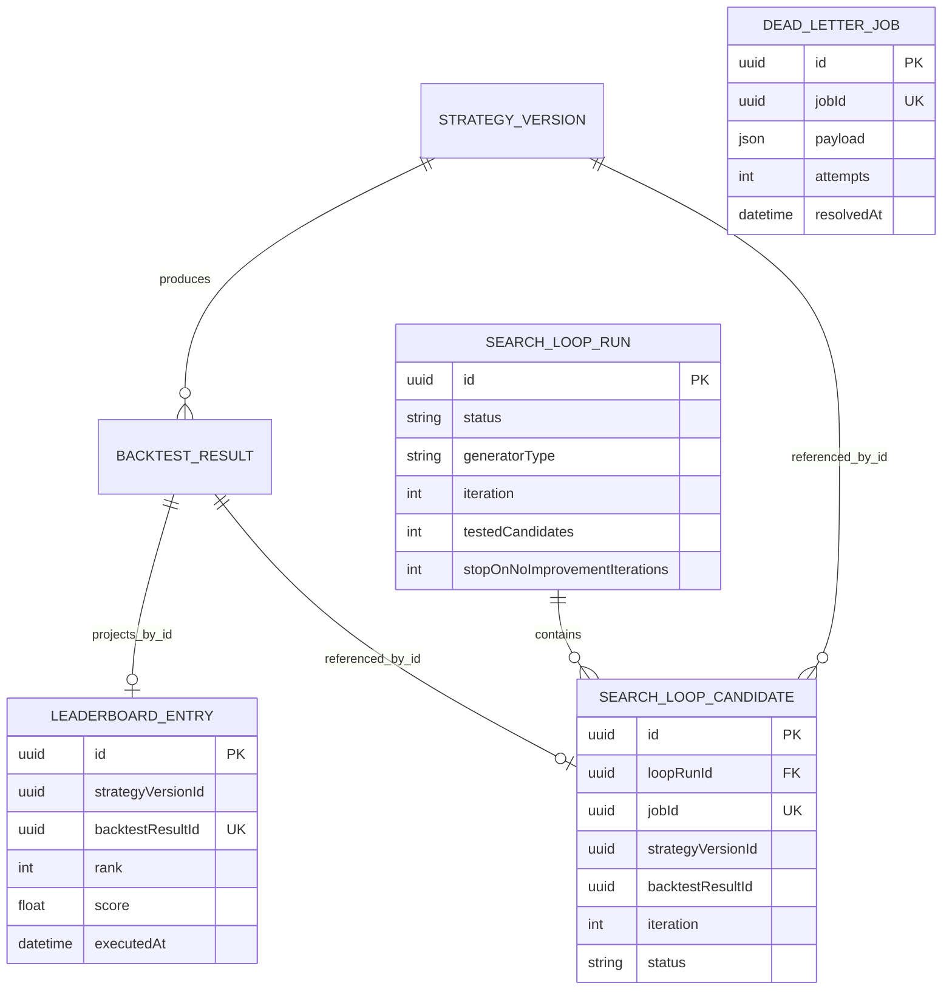

# Data Model: Event Infrastructure Dashboard

## Entity Relationship Diagram

`StrategyVersion` and `BacktestResult` remain Strategy Engine-owned. Diagram edges to them are ID-level domain references; Event Infrastructure does not navigate their tables directly.

## Persistent Entities

### LeaderboardEntry

| Field | Type | Constraints | Notes |
|-------|------|-------------|-------|
| `id` | UUID | PK, generated | Entry identity |
| `rank` | integer | required, indexed | Deterministic global rank after last recomputation |
| `strategyVersionId` | UUID | required, indexed | ID-only reference; no cross-module join |
| `strategyName` | string | required | Denormalized display value from completion Event |
| `strategyType` | string | required | Contract-defined Strategy type |
| `isComposite` | boolean | required | Display/filter metadata |
| `backtestResultId` | UUID | required, unique | Idempotency key and ID-only reference |
| `score` | float | required | Computed Leaderboard score |
| `totalReturn` | float | required | Percentage |
| `winRate` | float | required, range `[0,1]` at service boundary | Normalized rate |
| `maxDrawdown` | float | required | Signed percentage |
| `sharpeRatio` | float | required | Tie-break input |
| `totalTrades` | integer | required, non-negative | Zero is valid |
| `executedAt` | DateTime | required | Source Backtest execution time; new field |
| `createdAt` | DateTime | generated | Persistence time |
| `updatedAt` | DateTime | auto-updated | Projection update time |

### SearchLoopRun

| Field | Type | Constraints | Notes |
|-------|------|-------------|-------|
| `id` | UUID | PK, generated | `loopRunId` |
| `status` | string/enum | required, indexed | `RUNNING`, `PAUSED`, `COMPLETED`, `STOPPED_BY_USER`, `FAILED` |
| `generatorType` | string/enum | required | `RANDOM` or `DOMAIN_GUIDED` in MVP |
| `iteration` | integer | required, default 0 | Last generated iteration |
| `testedCandidates` | integer | required, default 0 | Terminal candidates only |
| `maxCandidates` | integer | nullable, positive when set | Stop bound |
| `maxDurationMs` | integer | nullable, positive when set | Stop bound |
| `stopOnNoImprovementIterations` | integer | required, default 50 | Always-active safety bound when others absent |
| `currentCandidateStrategyVersionId` | UUID | nullable | ID-only reference |
| `bestStrategyVersionId` | UUID | nullable | ID-only reference |
| `bestScore` | float | nullable | Null until a success |
| `stopReason` | string | nullable | Deterministic machine-readable reason |
| `startedAt` | DateTime | generated | Run start |
| `pausedAt` | DateTime | nullable | Current/last pause |
| `stoppedAt` | DateTime | nullable | Terminal time |

### SearchLoopCandidate

| Field | Type | Constraints | Notes |
|-------|------|-------------|-------|
| `id` | UUID | PK, generated | Candidate record identity |
| `loopRunId` | UUID | FK to `SearchLoopRun`, indexed | Owning run |
| `jobId` | UUID | required, unique | New event-correlation/idempotency field |
| `strategyVersionId` | UUID | required | ID-only Strategy reference |
| `backtestResultId` | UUID | nullable | Set on successful terminal result |
| `iteration` | integer | required | Stable ordering inside run |
| `score` | float | nullable | Set only for valid completed result |
| `status` | string/enum | required | `GENERATING`, `BACKTESTING`, `EVALUATED`, `FAILED` |
| `createdAt` | DateTime | generated | Creation time |
| `updatedAt` | DateTime | auto-updated | Status/result update time; new field |

### DeadLetterJob

| Field | Type | Constraints | Notes |
|-------|------|-------------|-------|
| `id` | UUID | PK, generated | Record identity |
| `jobId` | UUID | required, unique | Original producer ID |
| `jobType` | string | required | `BACKTEST` in MVP |
| `payload` | JSON | required | Original request payload |
| `attempts` | integer | required | Total attempts used |
| `lastError` | string | required | Sanitized operational reason |
| `deadLetteredAt` | DateTime | generated | Terminal time |
| `resolvedAt` | DateTime | nullable | Set when manual retry is accepted |

## Redis/BullMQ Operational Models

### BullMQ Backtest Job

Stored by BullMQ in Redis under queue `backtest`. BullMQ `job.id` is the producer UUID. Job data contains the contract payload and correlation identity; BullMQ metadata owns attempts made, priority, timestamps, delay, failure reason, progress, and lifecycle state. USER priority is `1`; SEARCH_LOOP priority is `10`.

### JobStatus

`JobStatus` is a projection of BullMQ states: waiting/prioritized/delayed → `QUEUED`, active → `PROCESSING`, completed → `COMPLETED`, failed before terminal handling → `FAILED`, and a terminal failed job with an unresolved PostgreSQL mirror → `DEAD_LETTER`. `completedLast24h` is derived from retained BullMQ completion timestamps.

### EventEnvelope

Immutable delivery wrapper. It is not persisted in MVP; correlation identity is propagated into logs and downstream payload/envelope metadata.

## Indexes

- Existing `LeaderboardEntry.backtestResultId` unique index enforces idempotency.
- Existing `LeaderboardEntry.rank` supports default reads.
- Existing `LeaderboardEntry.strategyVersionId` supports best-per-version projection.
- New `LeaderboardEntry(score, executedAt)` composite index is optional only if query profiling requires it; MVP may sort the course-scale projection without it.
- Existing `SearchLoopRun.status` supports active-run lookup.
- Existing `SearchLoopCandidate.loopRunId` supports run detail reads.
- New unique `SearchLoopCandidate.jobId` supports terminal Event idempotency.
- Existing unique `DeadLetterJob.jobId` prevents duplicate DLQ transitions.
- BullMQ custom `jobId` prevents a second live/retained job with the same producer UUID in queue `backtest`.

## Migration Notes

1. Add non-null `executedAt` to `LeaderboardEntry`. Because the table is currently a skeleton with no delivered Member D data, create the field without a legacy backfill; if data exists at migration time, backfill from `createdAt` before applying non-null.
2. Add `jobId` to `SearchLoopCandidate`; use the same empty-table/backfill check and add a unique constraint.
3. Add `updatedAt` to `SearchLoopCandidate` with Prisma `@updatedAt`.
4. Change `stopOnNoImprovementIterations` to non-null default 50; backfill null values to 50 first if any exist.
5. Hoàng, as Prisma owner, reviews and applies the migration. No relation to Strategy-owned tables is added.

## State Invariants

- One `backtestResultId` maps to at most one Leaderboard entry.
- One `jobId` maps to at most one Search Loop candidate and one unresolved Dead-letter record.
- `testedCandidates` equals terminal candidate count for the run.
- A run in a terminal state never generates another candidate.
- A paused run may record its current in-flight candidate but does not generate a successor.
- `source=USER` requires no Loop ID; `source=SEARCH_LOOP` requires a Loop ID.
- Redis is authoritative for live queue lifecycle; PostgreSQL `DeadLetterJob` is the terminal audit/API mirror.
- BullMQ retention must not remove a job before the configured operator inspection window.
- Recovered/stalled execution may occur at least once; result and terminal side effects remain idempotent.
