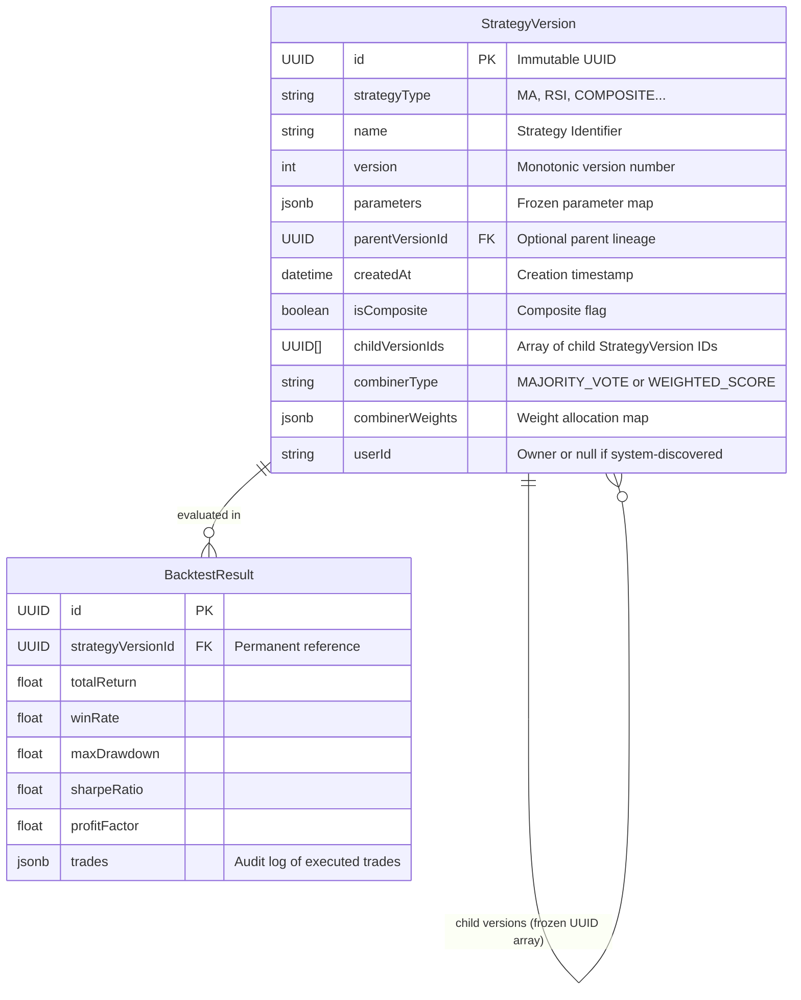

# Data Model: Immutable Strategy Enforcement

## Entity Relationship & Immutability Architecture

## Immutability Invariant Guarantees
1. **Insert-Only Lifecycle**:
   - `StrategyVersion` records are only ever created via `INSERT INTO "StrategyVersion"`.
   - `UPDATE` queries on `StrategyVersion` are prohibited across the application codebase.
   - `DELETE` queries on `StrategyVersion` are prohibited; foreign key references from `BacktestResult` remain perpetually intact.

2. **Lineage Preservation**:
   - For composite strategies, `childVersionIds` contains frozen UUID references to the exact snapshot version of each child strategy.
   - Because child versions cannot be deleted, `StrategyExecutionPort.resolveVersion()` is guaranteed never to encounter a missing child version.

## Migration Notes
- **No Database Schema Migration Required**: The existing PostgreSQL schema already models `StrategyVersion` as independent snapshot records. No alter table or drop statements are needed.
