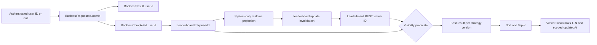

# Data Model: Per-User Leaderboard Live Toggle

## Entity Relationship and Identity Flow



`SearchLoopRun` and `SearchLoopCandidate` are intentionally absent from the ownership relationship. They remain global system entities.

## Entities

### StrategyVersion (existing, Strategy Engine owned)

| Field | Type | Constraints | Notes |
|-------|------|-------------|-------|
| `id` | UUID/string | Primary key | Existing immutable strategy version identity. |
| `userId` | UUID/string or null | Nullable | Null = system/shared; non-null = user-created/private. Already present. |

No change is required by this feature. Strategy ownership is not used to infer backtest-result ownership.

### BacktestRequested payload (existing event contract)

| Field | Type | Constraints | Notes |
|-------|------|-------------|-------|
| `jobId` | UUID/string | Required, producer-generated | Queue identity. |
| `userId` | UUID/string or null | Required | USER producer supplies current user; SEARCH_LOOP producer supplies null. |
| `source` | `USER` or `SEARCH_LOOP` | Required discriminant | Existing contract. |
| `loopRunId` | UUID/string or null | USER=null; SEARCH_LOOP=required | Does not replace `userId`. |
| Other backtest fields | Existing contract types | Required as defined | Unchanged. |

### BacktestResult (existing Prisma model)

| Field | Type | Constraints | Notes |
|-------|------|-------------|-------|
| `id` | UUID/string | Primary key | Persisted result identity. |
| `jobId` | UUID/string | Unique | Existing idempotency key. |
| `userId` | UUID/string or null | Nullable | Copied unchanged from request; already present in Prisma schema. |
| `strategyVersionId` | UUID/string | Required | ID-only ownership boundary remains unchanged. |
| Metrics/trades/timestamps | Existing types | Existing constraints | Unchanged. |

### BacktestCompleted payload (existing event, shared type drift)

| Field | Type | Constraints | Notes |
|-------|------|-------------|-------|
| `userId` | UUID/string or null | Required | Add to shared TypeScript; YAML already requires it. |
| `backtestResultId` | UUID/string | Required | Links leaderboard entry to persisted result. |
| `strategyVersionId` | UUID/string | Required | Existing strategy identity. |
| Metrics and metadata | Existing contract types | Required | Unchanged. |

### LeaderboardEntry (existing Prisma model)

| Field | Type | Constraints | Notes |
|-------|------|-------------|-------|
| `id` | UUID/string | Primary key | Existing. |
| `userId` | UUID/string or null | Nullable | Copied from BacktestCompleted; already present in Prisma schema. |
| `backtestResultId` | UUID/string | Unique | Preserves idempotent observer behavior. |
| `strategyVersionId` | UUID/string | Required | Best-per-version grouping key. |
| `rank` | integer | Existing persisted field | Global stored value retained for compatibility; public projections recompute viewer-local rank. |
| Metrics and timestamps | Existing types | Existing constraints | Used for ranking and scoped `updatedAt`. |

### LeaderboardEntryPayload (shared API/event projection)

| Field | Type | Constraints | Notes |
|-------|------|-------------|-------|
| `rank` | integer | 1 through N in a returned view | Recomputed after visibility filter. |
| `userId` | UUID/string or null | Required | Add to shared TypeScript to match YAML. |
| Existing entry fields | Existing types | Required | Unchanged. |

### LeaderboardSnapshot (existing response projection)

| Field | Type | Constraints | Notes |
|-------|------|-------------|-------|
| `rankingCriterion` | Existing enum | Required | Caller-selected criterion. |
| `updatedAt` | DateTime | Required | Maximum `updatedAt` among caller-visible rows; epoch when none. |
| `entries` | `LeaderboardEntryPayload[]` | Length 0..K | Visible, best-per-version, sorted, sliced, ranks `1..N`. |

### LeaderboardUpdated (amended safe global event/wire payload)

| Field | Type | Constraints | Notes |
|-------|------|-------------|-------|
| `updatedAt` | DateTime | Required | Computed from system entries only. |
| `triggeredByBacktestResultId` | UUID/string or null | Nullable | System result ID when the trigger is system-owned; null for private trigger. |
| `rankingCriterion` | Existing enum | Required | SCORE for observer publication. |
| `topK` | `LeaderboardEntryPayload[]` | System rows only | Every item must have `userId = null`; frontend treats it as invalidation, not user snapshot. |

### Live Updates Preference (frontend state only)

| Field | Type | Constraints | Notes |
|-------|------|-------------|-------|
| `liveUpdatesEnabled` | boolean | Default true | Controls only the leaderboard event listener. |

This state is not persisted to PostgreSQL, Redis, local storage, or user profile data.

### SearchLoopRun (existing global entity)

| Field | Type | Constraints | Notes |
|-------|------|-------------|-------|
| Existing fields | Existing types | Existing constraints | No `userId` added; reads and lifecycle remain global. |

## Visibility Predicate

```text
anonymous (currentUserId = null):
  userId IS NULL

authenticated (currentUserId = A):
  userId IS NULL OR userId = A
```

The predicate is applied before:

1. best result per `strategyVersionId` selection;
2. criterion sorting;
3. Top-K slicing;
4. response rank assignment;
5. detail target selection;
6. maximum `updatedAt` calculation.

## Rank Projection

For list/Top-K, after filtering, grouping, sorting, and slicing:

```text
visibleEntries.map((entry, index) => ({ ...entry, rank: index + 1 }))
```

For detail, derive the visible SCORE-sorted best-per-version list, locate the requested version, and assign its one-based index. An invisible or missing target produces null at the service boundary and stable 404 at REST.

## Indexes

Existing indexes remain unchanged:

- `LeaderboardEntry(rank)`
- `LeaderboardEntry(strategyVersionId)`
- unique `LeaderboardEntry(backtestResultId)`

No new index or migration is part of this feature. A future measured optimization may consider `(userId, updatedAt)` without changing the visibility contract.

## Migration Notes

- No Prisma migration is created.
- Nullable `userId` already exists on `StrategyVersion`, `BacktestResult`, and `LeaderboardEntry` in `workspace/apps/backend/prisma/schema.prisma`.
- Existing null rows remain system/shared.
- No backfill is required.
- No field is added to `SearchLoopRun` or `SearchLoopCandidate`.
