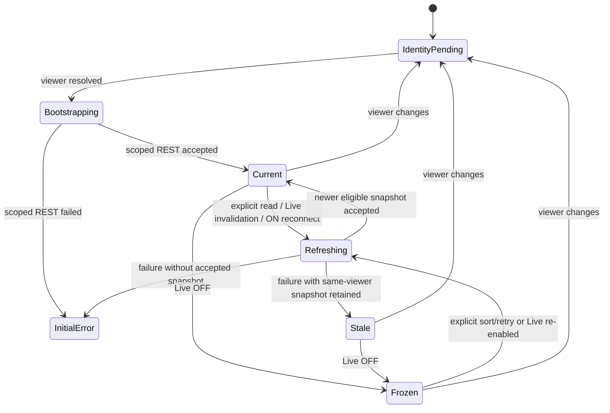

# Data Model: Split Leaderboard Boxes

**Feature**: `split-leaderboard-boxes` | **Date**: 2026-08-25

## Persistence Impact

No persistent entity, Prisma field, relation, index, or migration changes.

The existing `LeaderboardEntry.userId` remains the ownership source:

- `null`: System Data.
- verified user UUID: private data owned by that user.

Persisted global `rank` and global `rerank()` remain for compatibility. Public list/detail projections calculate response-local ranks after visibility filtering.

## Existing Entity Relationship

```mermaid
erDiagram
    STRATEGY_VERSION ||--o{ BACKTEST_RESULT : produces
    BACKTEST_RESULT ||--o| LEADERBOARD_ENTRY : publishes

    STRATEGY_VERSION {
      string id PK
      string userId nullable
    }
    BACKTEST_RESULT {
      string id PK
      string strategyVersionId FK
      string userId nullable
    }
    LEADERBOARD_ENTRY {
      string id PK
      string backtestResultId UK
      string strategyVersionId
      string userId nullable
      int rank
      float score
      datetime updatedAt
    }
```

All ownership propagation remains governed by the existing per-user leaderboard baseline. This feature only changes read projections.

## Request Value Object: Leaderboard Query

| Field | Type | Default | Validation |
|---|---|---|---|
| `rankingCriterion` | existing `RankingCriterion` | `score` | Existing supported criterion enum |
| `scope` | `LeaderboardScope` | `combined` | `system`, `mine`, or `combined`; invalid explicit value is rejected |
| `viewerUserId` | `string \| null` | resolved by auth guard | Never accepted from query/body |

## Logical Entity: Visibility Resolution

```ts
type LeaderboardVisibility =
  | { kind: 'query'; where: Prisma.LeaderboardEntryWhereInput }
  | { kind: 'empty' };
```

| Scope | Viewer | Resolution |
|---|---|---|
| System | any | query `userId IS NULL` |
| Mine | authenticated A | query `userId = A` |
| Mine | anonymous | empty |
| Combined | anonymous | query `userId IS NULL` |
| Combined | authenticated A | query `userId IS NULL OR userId = A` |

The empty resolution is an authorization result, not a database row or fake user.

## Logical Entity: Scope Projection

```ts
interface LeaderboardProjection {
  scope: LeaderboardScope;          // internal/request context
  viewerUserId: string | null;      // verified server context
  rankingCriterion: RankingCriterion;
  entries: LeaderboardEntryPayload[];
  updatedAt: Date;
}
```

The public response omits `scope` and `viewerUserId` and remains `LeaderboardSnapshot`.

### Projection Invariants

1. Visibility is resolved before any candidate participates.
2. Best-per-version sees only visible rows.
3. Existing criterion comparison and tie rules are unchanged.
4. Top-K is independently applied per projection.
5. Response ranks equal `1..entries.length`.
6. `updatedAt` is the maximum visible row timestamp or epoch for empty visibility.
7. No row/count/rank/timestamp from another scope affects the projection.
8. Detail lookup uses the same visibility resolution before strategy-version matching.

## Frontend Value Object: Projection Key

```ts
type ProjectionKey = `${LeaderboardScope}:${RankingCriterion}`;
```

Viewer identity is not embedded in this string because the containing cache envelope and every accepted snapshot are exact-viewer stamped. Effective uniqueness is:

```text
viewerKey + scope + rankingCriterion
```

## Frontend Entity: Accepted Projection

```ts
interface AcceptedProjection {
  viewerKey: string;
  identityGeneration: number;
  scope: LeaderboardScope;
  rankingCriterion: RankingCriterion;
  requestGeneration: number;
  acceptedAt: Date;
  snapshot: LeaderboardSnapshot;
}
```

### Commit Eligibility

An accepted projection can render or persist only if all conditions hold:

- provider is mounted;
- resolved current viewer equals `viewerKey`;
- active viewer equals `viewerKey`;
- current identity generation matches;
- projection scope and criterion match the request key;
- request generation is latest for the projection key;
- request was not aborted;
- projection is still maintained;
- snapshot timestamp is not older than its accepted watermark.

## Frontend Entity: Projection UI State

```ts
interface ProjectionState {
  scope: LeaderboardScope.SYSTEM | LeaderboardScope.MINE;
  snapshot: LeaderboardSnapshot | null;
  loading: boolean;
  error: Error | null;
  isStale: boolean;
  lastSuccessfulAt: Date | null;
}
```

System and Mine states are independent. A refresh failure changes only the matching projection state and may retain only that projection's last successful same-viewer snapshot.

## Frontend Entity: Selected Strategy

```ts
interface SelectedLeaderboardStrategy {
  strategyVersionId: string;
  sourceScope: LeaderboardScope;
}
```

### Selection Rules

- Selecting a row records its source scope.
- Detail uses the source scope in the REST query.
- A Dashboard URL selection without explicit scope defaults to combined.
- Identity change clears selection before the new viewer renders.
- Projection refresh/sort clears selection if its ID no longer exists in the selected source scope.
- A late detail response commits only for the same viewer, identity generation, strategy ID, and source scope.

## Browser Cache Envelope V2

```ts
interface PersistedLeaderboardCacheV2 {
  version: 2;
  viewerKey: string;
  activeCriterion: RankingCriterion;
  selectedStrategy: {
    strategyVersionId: string;
    sourceScope: LeaderboardScope;
  } | null;
  snapshots: Partial<
    Record<LeaderboardScope, Partial<Record<RankingCriterion, SerializedSnapshot>>>
  >;
  persistedAt: string;
}
```

### Cache Rules

- Accept only exact viewer match after Auth resolution.
- Do not hydrate v1 criterion-only cache as scoped data.
- Retain combined SCORE plus System/Mine active criterion only.
- Anonymous envelope cannot contain accepted Mine private data.
- Identity switch clears memory, controllers, generations, watermarks, detail eligibility, selection, and the prior envelope.
- Storage failure falls back to current-viewer memory and authoritative REST.

## State Transitions



Each System/Mine projection follows its own display state, while identity generation and Live preference are provider-wide boundaries.

## Non-Entities

The following are explicitly not added:

- user-owned `SearchLoopRun` or `SearchLoopCandidate`;
- persisted per-scope rank or timestamp;
- socket room membership or connection identity;
- private websocket snapshot;
- client-owned authorization predicate;
- Dashboard-specific split snapshot.

